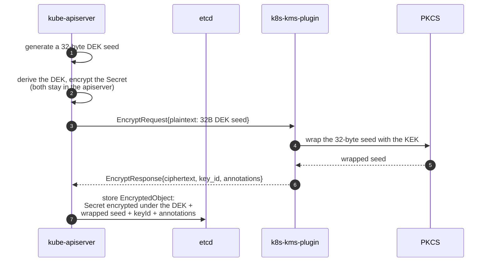

# `k8s-kms-plugin` 🔐

[](./LICENSE)
[](https://pkg.go.dev/github.com/eclipse-keysealer/k8s-kms-plugin)
[](https://github.com/eclipse-keysealer/k8s-kms-plugin/actions/workflows/ci.yml)
[](https://github.com/eclipse-keysealer/k8s-kms-plugin/actions/workflows/lint.yml)
[](https://github.com/eclipse-keysealer/k8s-kms-plugin/actions/workflows/secret-scan.yml)
[](https://github.com/eclipse-keysealer/k8s-kms-plugin/actions/workflows/release.yml)
[](https://scorecard.dev/viewer/?uri=github.com/eclipse-keysealer/k8s-kms-plugin)
[](https://github.com/eclipse-keysealer/k8s-kms-plugin/releases/latest)
[](./CHANGELOG.md)

`k8s-kms-plugin serve` implements the [Kubernetes KMS v2 API](https://pkg.go.dev/k8s.io/kms/apis/v2) protocol as a gRPC service that leverages a remote or local HSM via PKCS11.
`k8s-kms-plugin serve rotation` supports key rotation operations.

Supported `--algorithm-family` values (key size / parameter set is derived at runtime from the HSM key):

- `aes-gcm` — AES-GCM symmetric encryption (128 / 192 / 256-bit)
- `aes-cbc` — AES-CBC symmetric encryption with HMAC-SHA256 authentication
- `rsa-oaep` — RSA-OAEP asymmetric encryption
- `ml-kem` — post-quantum ML-KEM hybrid encryption (CRYSTALS-Kyber / FIPS 203; ML-KEM-512, ML-KEM-768, ML-KEM-1024)

For what each family actually does to the data — keys used, primitives composed, wire format, and which
operations run inside the HSM — see [Cryptographic Schemes](./docs/cryptographic-schemes.md).

This plugin will also run in proxy mode which can connect to a remote plugin service running in a secure network device (Key Managers)

> ⚠️ **Droping support of KMS v1**: Newer (after 2025) version of the `k8s-kms-plugin` droped support for [Kubernetes KMSv1](https://pkg.go.dev/k8s.io/kms@v0.34.1/apis/v1beta1),
> as KMSv1 is deprecated in Kubernetes v1.28 and disabled by default since Kubernetes v1.29.

> 🚧 **Note**: This documentation is under construction and needs to be updated to remove/archive references to KMS v1 and
> document KMS v2 operations.

# Part of Eclipse KeySealer

`k8s-kms-plugin` is part of [Eclipse KeySealer](https://projects.eclipse.org/projects/technology.keysealer),
which brings HSM-backed key management to Kubernetes. It relies on [crypto11](https://github.com/eclipse-keypont/crypto11), [gose](https://github.com/eclipse-keypont/gose)
and [pkcs11-go](https://github.com/eclipse-keypont/pkcs11-go) from the related
[Eclipse Keypont](https://projects.eclipse.org/projects/technology.keypont) project for its PKCS#11 bindings. _"Pont"_ is french for "bridge"

# 🚤 Quick Start 🚀

**TL;DR**: For a quick start experience, try the `k8s-kms-plugin` with a software (virtual) HSM, then plug it into a
throwaway Kubernetes cluster:

1. [SoftHSMv3 (`pqctoday-hsm`) & `k8s-kms-plugin`](./docs/softhsm-v3.md) — **recommended** HSM: supports all algorithm families including ML-KEM
2. [`KinD` & `k8s-kms-plugin`](./docs/kind-kubernetes.md) — **recommended** cluster: single-node Kubernetes on Podman or Docker, deleted in one command

Other HSMs & TPMs (Thales eToken Fusion, YubiHSM 2, SoftHSMv2, TPM emulator) and the `k3s` integration are listed in
the documentation index: [`docs/README.md`](./docs/README.md).

# Table of Contents

- [1. Definions \& Accronyms 🔎](#1-definions--accronyms-)
- [2. Overview 🔭](#2-overview-)
  - [2.1. Architecture](#21-architecture)
  - [2.2. Deployment Scenarios Examples](#22-deployment-scenarios-examples)
  - [2.3. Key Rotation Support](#23-key-rotation-support)
- [3. Installation 🔧](#3-installation-)
  - [3.1. kubernetes Requirements](#31-kubernetes-requirements)
    - [3.1.1. `k3s` kubernetes example](#311-k3s-kubernetes-example)
  - [3.2. Install `k8s-kms-plugin` From Official Packages](#32-install-k8s-kms-plugin-from-official-packages)
    - [3.2.1. `apk` on Wolfi OS packages](#321-apk-on-wolfi-os-packages)
    - [3.2.2. `archlinux` packages](#322-archlinux-packages)
    - [3.2.3. `deb` debian packages](#323-deb-debian-packages)
    - [3.2.4. `rpm` RPM packages](#324-rpm-rpm-packages)
    - [3.2.5. Binary](#325-binary)
  - [3.3. Install `k8s-kms-plugin` with `go install`](#33-install-k8s-kms-plugin-with-go-install)
    - [3.3.1. Always Pin an Explicit Version](#331-always-pin-an-explicit-version)
    - [3.3.2. Limitation: `version` Reports an Empty Snapshot](#332-limitation-version-reports-an-empty-snapshot)
  - [3.4. Build `k8s-kms-plugin` locally from Source with `make`](#34-build-k8s-kms-plugin-locally-from-source-with-make)
    - [3.4.1. Build Requirements](#341-build-requirements)
    - [3.4.2. Local Development Build (native architecture)](#342-local-development-build-native-architecture)
    - [3.4.3. Release-style Cross-Architecture Builds](#343-release-style-cross-architecture-builds)
    - [3.4.4. Debug Builds](#344-debug-builds)
    - [3.4.5. Other Useful `make` Targets](#345-other-useful-make-targets)
  - [3.5. Build `k8s-kms-plugin` **locally** from Source with `goreleaser`](#35-build-k8s-kms-plugin-locally-from-source-with-goreleaser)
  - [3.6. Build the Container Image](#36-build-the-container-image)
- [4. Documentation, Usage \& User Guides 📚](#4-documentation-usage--user-guides-)
  - [4.1. Where to Find What](#41-where-to-find-what)
  - [4.2. CLI Help Messages](#42-cli-help-messages)
  - [4.3. CLI Auto Completion for `bash`, `fish`, `zsh`](#43-cli-auto-completion-for-bash-fish-zsh)
  - [4.4. CLI Auto Generated Documentation](#44-cli-auto-generated-documentation)
  - [4.5. User Input Priority: CLI \> Env Vars \> Config File \> Default](#45-user-input-priority-cli--env-vars--config-file--default)
  - [4.6. HSM \& TPM Supported Platforms](#46-hsm--tpm-supported-platforms)
- [5. Development Environment 🔬](#5-development-environment-)
  - [5.1. Running the Tests](#51-running-the-tests)
  - [5.2. Build Against `crypto11` / `gose` Development Branches](#52-build-against-crypto11--gose-development-branches)
- [6. Debug Environment 🐛](#6-debug-environment-)
  - [6.1. `delve` Remote Debug](#61-delve-remote-debug)
  - [6.2. `vscode` Debug](#62-vscode-debug)
- [7. Vulnerability check 💣](#7-vulnerability-check-)
  - [7.1. Locally, before pushing](#71-locally-before-pushing)
  - [7.2. In CI (GitHub Actions)](#72-in-ci-github-actions)
- [8. Release Signing \& Attestations 📝](#8-release-signing--attestations-)
- [9. Verifying the authenticity of an artifact 📝🔍](#9-verifying-the-authenticity-of-an-artifact-)
- [10. Verifying the container image and its SLSA provenance](#10-verifying-the-container-image-and-its-slsa-provenance)

## 1. Definions & Accronyms 🔎

| Term         | Definition                               |
|--------------|------------------------------------------|
| **DEK**      | Data Encryption Key                      |
| **HA**       | High Availability                        |
| **HSM**      | Hardware Security Module                 |
| **JOSE**     | JOSE JSON Objects Signing and Encryption |
| **k3s**      | A Lightweight Kubernetes Distribution    |
| **k8s**      | Kubernetes (short for)                   |
| **KinD**     | Kubernetes in Docker (or Podman)         |
| **KEK**      | Key Encryption Key                       |
| **KMS**      | Key Management System                    |
| **PKCS #11** | Public Key Cryptography Standard #11     |
| **TPM**      | Trusted Platform Module                  |

## 2. Overview 🔭

### 2.1. Architecture

The [`k8s-kms-plugin`](https://github.com/eclipse-keysealer/k8s-kms-plugin) uses `gose`  and `crypto11`:

- [github.com/eclipse-keypont/gose](https://github.com/eclipse-keypont/gose): support in GoLang for JOSE JSON Objects Signing and Encryption;
- [github.com/eclipse-keypont/crypto11](https://github.com/eclipse-keypont/crypto11): Implements crypto.Signer abd crypto.Decrypter for PKCS#11 devices;
- [k8s.io/kms/apis/v2](https://pkg.go.dev/k8s.io/kms/apis/v2) (source code: https://github.com/kubernetes/kms): KMS v2 API & gRPC protobuf API files.

> 🚧 Note: We will work on providing a full nested SBOM later.

Figure below sums up the main dependencies of `k8s-kms-plugin`:


At runtime the plugin occupies exactly one step of the KMS v2 *envelope* scheme: it **never sees your `Secret`
data**, only the 32-byte DEK seed that `kube-apiserver` asks it to wrap with the KEK held on the TPM or HSM.



How that wrapping is actually done — JWE for `aes-gcm` / `aes-cbc` / `rsa-oaep`, a binary envelope plus a
`kem-ciphertext` annotation for `ml-kem` — is detailed in
[Cryptographic Schemes](./docs/cryptographic-schemes.md). The `StatusRequest` heartbeat, the `DecryptRequest`
path and key rotation are drawn in full in the sequence diagrams of [2.2](#22-deployment-scenarios-examples).

### 2.2. Deployment Scenarios Examples

The following sequence diagram illustrates the communication between `kubernetes` ([KMS v2 API](https://pkg.go.dev/k8s.io/kms/apis/v2)), `k8s-kms-plugin`, and a [PKCS #11](https://docs.oasis-open.org/pkcs11/pkcs11-base/v3.0/pkcs11-base-v3.0.html) capable device like a TPM or HSM.

<details>
<summary>➡️ <b>click here</b> to show 🔦 k8s-kms-plugin & KMS v2 API Sequence Diagram </summary>


> This diagram was inspired by those from https://github.com/kubernetes/enhancements/tree/master/keps/sig-auth/3299-kms-v2-improvements

</details>

&NewLine;

The figure below illustrates several example of how the `k8s-kms-plugin` can be deployed for a Kubernetes Single Node cluster and using an embedded TPM or an HSM as a PKCS #11 capable key store.


The `k8s-kms-plugin` also supports kubernetes cluster in HA mode (at least 3 server nodes), as long as the KEK is the same for each kubernetes node in the HA cluster. Otherwise it will fail to work with the Raft consensus algorithm for the synchronization of the content of the etcd cluster.


<details>
<summary>➡️ <b>click here</b> to show 🔦 other HA k8s-kms-plugin deployments</summary>


</details>

### 2.3. Key Rotation Support

Look at [`k8s-kms-plugin serve rotation`](./docs/cli-user-interface/markdown/k8s-kms-plugin_serve_rotation.md) for examples.

Figures below illustrate a Key Rotation sequence. First the KEK is stored on a TPM. Then rotation is being performed to use a USB HSM to store the new KEK.


## 3. Installation 🔧

### 3.1. kubernetes Requirements

`k8s-kms-plugin` is designed for kubernetes clusters that are using version v1.29 or higher and implements the [KMS v2 API](https://pkg.go.dev/k8s.io/kms/apis/v2). See also:
https://kubernetes.io/docs/tasks/administer-cluster/kms-provider/

⚠️ `k8s-kms-plugin` **does not support KMS v1** which is deprecated in Kubernetes v1.28 and disabled by default since Kubernetes v1.29.

To serve the `k8s-kms-plugin` for encryption operations from Kubernetes, you will need at least one AES, RSA or ML-KEM key in a supported PKCS #11 provider.

#### 3.1.1. `k3s` kubernetes example

We use `k3s` as an example of a Kubernetes distribution that supports [KMS v2](https://pkg.go.dev/k8s.io/kms/apis/v2).

Assuming you have configured a PKCS #11 TPM or HSM, you can start the `k8s-kms-plugin`:

```bash
k8s-kms-plugin \
  serve \
    --log-level=trace \
    --socket /run/user/1000/k8s-kms-plugin.sock \
    --p11-lib /usr/lib64/pkcs11/libtpm2_pkcs11.so \
    --p11-label mylabel \
    --p11-pin mypin \
    --p11-key-id 33653932616130656634343238346163 \
    --algorithm-family rsa-oaep
```

> This example uses [`Software TPM Emulator`](https://github.com/stefanberger/swtpm).

Then review the content of file [`encryption-conf-kmsv2-unix-socket.yaml`](./deployments/k8s/encryption-conf-kmsv2-unix-socket.yaml).
Make sure `resources.providers.kms.endpoint` points to the same unix socket file of the running `k8s-kms-plugin`.

Then install `k3s` with the following command:

```bash
curl -sfL https://get.k3s.io | K3S_DEBUG=true INSTALL_K3S_VERSION=v1.33.1+k3s1 sh -s - \
  --write-kubeconfig-mode 660 \
  --kube-apiserver-arg=encryption-provider-config=$HOME/k8s-kms-plugin/deployments/k8s/encryption-conf-kmsv2-unix-socket.yaml
```

### 3.2. Install `k8s-kms-plugin` From Official Packages

As of now, `k8s-kms-plugin`'s Github Action Build Recipe supports building `apk`, `deb`, `rpm` and `archlinux` for
Linux x86 platform. Check the different package artefacts from the [releases](https://github.com/eclipse-keysealer/k8s-kms-plugin/releases)
tab.

> 🚧 **Note**: The packages are not available on official repos yet.
> And signature remains to be added in the CICD build recipe.
> Therefore, this doc only shows local installation of the package.

#### 3.2.1. `apk` on Wolfi OS packages

For now, `k8s-kms-plugin` does not support installation on Alpine Linux. Indeed, for now we are not building the `k8s-kms-plugin` package with the musl libc. We only support the glibc.

But `k8s-kms-plugin` supports installation on Wolfi OS as it uses the glibc.

Until the packages are available on official repos and signed, you can install the package from the following command:

Example on Wolfi OS:

```bash
apk add --allow-untrusted ./k8s-kms-plugin_SNAPSHOT-3239cd9_x86_64.apk
```

#### 3.2.2. `archlinux` packages

See https://wiki.archlinux.org/title/Pacman#Additional_commands

Command should look like this:

```bash
pacman -U ./k8s-kms-plugin-SNAPSHOT-3239cd9-1-x86_64.pkg.tar.zst
```

However, pacman needs a version that follows semantic versionning. Make sure you use the right package that uses semver, otherwise you get this error:

```
error: invalid metadata for package k8s-kms-plugin-SNAPSHOT-3239cd9-1 (package version contains invalid characters)
error: './k8s-kms-plugin-SNAPSHOT-3239cd9-1-x86_64.pkg.tar.zst': invalid or corrupted package
```

#### 3.2.3. `deb` debian packages

If you wish to install a snapshot version of `k8s-kms-plugin` (not following semantic versionning), you will need to use the following command `dpkg -i --force-all` to force the installation of the package. Otherwise, `dpkg` will fail with the following error:

```bash
$ sudo dpkg -i ./k8s-kms-plugin_SNAPSHOT-3239cd9_amd64.deb 
```
```
dpkg: error processing archive ./k8s-kms-plugin_SNAPSHOT-3239cd9_amd64.deb (--install):
 parsing file '/var/lib/dpkg/tmp.ci/control' near line 2 package 'k8s-kms-plugin':
 'Version' field value 'SNAPSHOT-3239cd9': version number does not start with digit
Errors were encountered while processing:
 ./k8s-kms-plugin_SNAPSHOT-3239cd9_amd64.deb
```

"Force" will only raise a warning:

```bash
dpkg --force-all -i ./k8s-kms-plugin_SNAPSHOT-3239cd9_amd64.deb
```

```
dpkg: warning: parsing file '/var/lib/dpkg/tmp.ci/control' near line 2 package 'k8s-kms-plugin':
 'Version' field value 'SNAPSHOT-3239cd9': version number does not start with digit
Selecting previously unselected package k8s-kms-plugin.
(Reading database ... 6089 files and directories currently installed.)
Preparing to unpack .../k8s-kms-plugin_SNAPSHOT-3239cd9_amd64.deb ...
Unpacking k8s-kms-plugin (SNAPSHOT-3239cd9) ...
Setting up k8s-kms-plugin (SNAPSHOT-3239cd9) ...
```

#### 3.2.4. `rpm` RPM packages

```bash
dnf install ./k8s-kms-plugin-SNAPSHOT-3239cd9-1.x86_64.rpm
```

#### 3.2.5. Binary

Move the `k8s-kms-plugin` binary to a relevant location under your `$PATH`, for example `/usr/local/bin/k8s-kms-plugin`.

### 3.3. Install `k8s-kms-plugin` with `go install`

If you already have a Go toolchain, `go install` fetches, builds and installs the binary in one command — no clone, no
`make`, no release artefact to download:

```bash
go install github.com/eclipse-keysealer/k8s-kms-plugin/cmd/k8s-kms-plugin@v1.0.0-rc3
```

The binary is installed into `$(go env GOBIN)`, or `$(go env GOPATH)/bin` when `GOBIN` is unset. Make sure that directory
is on your `$PATH`:

```bash
export PATH="$(go env GOPATH)/bin:$PATH"
k8s-kms-plugin serve --help
```

Requirements are the same as for a `make` build: a Go toolchain matching the `go` directive of the tagged
[`go.mod`](./go.mod), and a working **`CGO`** setup (a C compiler and the glibc/musl headers of your target), because the
PKCS#11 bindings are cgo-based. The resulting binary is dynamically linked against your system libc:

```bash
$ ldd $(go env GOPATH)/bin/k8s-kms-plugin
        linux-vdso.so.1
        libresolv.so.2 => /usr/lib/libresolv.so.2
        libc.so.6 => /usr/lib/libc.so.6
        /lib64/ld-linux-x86-64.so.2 => /usr/lib64/ld-linux-x86-64.so.2
```

As with every other build method, do not install on musl libc if you intend to run the plugin on glibc (and vice versa).

#### 3.3.1. Always Pin an Explicit Version

⚠️ **Do not use `@latest` for now.** Go's `@latest` deliberately skips pre-releases, and the newest non-pre-release tag
of this repository is still `v0.6.0` (February 2024). So `@latest` silently installs a two-year-old build:

```bash
$ curl -s https://proxy.golang.org/github.com/eclipse-keysealer/k8s-kms-plugin/@latest
{"Version":"v0.6.0","Time":"2024-02-14T09:32:16Z", ...}
```

Until `v1.0.0` is tagged, always pin the exact version you want. Available versions can be listed with:

```bash
go list -m -versions github.com/eclipse-keysealer/k8s-kms-plugin
```

#### 3.3.2. Limitation: `version` Reports an Empty Snapshot

`go install` cannot pass the `LDFLAGS` that the [`Makefile`](./Makefile) uses to stamp build metadata into
[`pkg/version`](./pkg/version/version.go). A `go install`-ed binary therefore reports an empty snapshot version:

```bash
$ k8s-kms-plugin version
k8s-kms-plugin: (snapshot)
```

This is cosmetic — the plugin itself is fully functional. The real version is still recorded in the Go build info, so
use `go version -m` to identify a binary:

```bash
$ go version -m $(go env GOPATH)/bin/k8s-kms-plugin | head -3
/home/user/go/bin/k8s-kms-plugin: go1.26.5
        path    github.com/eclipse-keysealer/k8s-kms-plugin/cmd/k8s-kms-plugin
        mod     github.com/eclipse-keysealer/k8s-kms-plugin      v1.0.0-rc3
```

If you need `k8s-kms-plugin version` to report the real version, build with `make` instead (see
[3.4](#34-build-k8s-kms-plugin-locally-from-source-with-make)) or download an official release artefact.

> 💡 **`goenv` users**: if `go install` fails with `compile: version "goX.Y.Z" does not match go tool version "goX.Y.W"`,
> your `GOROOT` environment variable is pinned to a different Go version than the `go` binary found on your `$PATH`.
> Unset it (`env -u GOROOT go install ...`) and let the `go` command locate its own `GOROOT`.

### 3.4. Build `k8s-kms-plugin` locally from Source with `make`

#### 3.4.1. Build Requirements

You should have `make`, `git` and `go` installed. Review the content of the [`Makefile`](./Makefile) file for more details.

The required Go version is the one declared in [`go.mod`](./go.mod) (currently **Go 1.26**). The CI workflows resolve it
with `go-version-file: go.mod`, so `go.mod` is the single source of truth — do not rely on the versions pinned in this
document.

[`NOTICES.md`](./NOTICES.md) lists all third-party dependency licenses and is auto-generated via `make notices` (requires [`go-licenses`](https://github.com/google/go-licenses)).

**`CGO`** is required to build the plugin (`CGO_ENABLED=1` is set by the `Makefile`): **make sure you are using the right
C Library** (glibc or musl) for your target environment. Do not build on musl libc if you intend to use the plugin on a
non-musl environment (glibc).

The build was tested with the following tool versions:

| Tool | Version tested                    | Check with       |
|------|-----------------------------------|------------------|
| Go   | `go1.26.5 linux/amd64`            | `go version`     |
| Make | `GNU Make 4.4.1`                  | `make --version` |
| Git  | `git version 2.55.0`              | `git version`    |
| GCC  | native `gcc` (for `CGO_ENABLED=1`) | `gcc --version`  |

Building for a **non-native architecture** additionally requires the matching cross-compiler toolchain. The `Makefile`
expects these compiler names:

| Target                | `CC` used                | Debian/Ubuntu packages                                       |
|-----------------------|--------------------------|--------------------------------------------------------------|
| `linux/amd64`         | `gcc` (native)           | `build-essential`                                            |
| `linux/arm64`         | `aarch64-linux-gnu-gcc`  | `gcc-aarch64-linux-gnu`, `g++-aarch64-linux-gnu`, `libc6-dev-arm64-cross`   |
| `linux/riscv64`       | `riscv64-linux-gnu-gcc`  | `gcc-riscv64-linux-gnu`, `g++-riscv64-linux-gnu`, `libc6-dev-riscv64-cross` |

This mirrors what the CI installs in [`.github/actions/setup-build-env/action.yml`](./.github/actions/setup-build-env/action.yml).

#### 3.4.2. Local Development Build (native architecture)

Run

```bash
make build
```

You should get a `k8s-kms-plugin` binary in the **`dist/`** directory:

```bash
./dist/k8s-kms-plugin version
```

This target builds for the host architecture, does not strip the binary (no `-s -w`), and does not require any
cross-compiler. It is the target to use for day-to-day development.

#### 3.4.3. Release-style Cross-Architecture Builds

The per-architecture targets produce stripped (`-s -w`) binaries whose names embed the version, matching the naming used
by the release artefacts:

```bash
make build-linux-amd64      # -> dist/k8s-kms-plugin_<version>_linux_amd64
make build-linux-arm64      # -> dist/k8s-kms-plugin_<version>_linux_arm64
make build-linux-riscv64    # -> dist/k8s-kms-plugin_<version>_linux_riscv64
```

`<version>` comes from `git describe --tags --always --dirty`.

The default target builds all three architectures at once (it requires every cross-compiler listed in
[3.4.1](#341-build-requirements)):

```bash
make            # equivalent to: make all
```

#### 3.4.4. Debug Builds

Each architecture has a `-debug` variant, built with `-gcflags="all=-N -l"` (inlining and optimisations disabled) and
without stripping, so the binary can be used with [`delve`](https://github.com/go-delve/delve):

```bash
make build-linux-amd64-debug
make build-linux-arm64-debug
make build-linux-riscv64-debug
```

The binary is written to `dist/k8s-kms-plugin_<version>_linux_<arch>`. Do not use these binaries in a production
environment. See [6.1. `delve` Remote Debug](#61-delve-remote-debug) for how to attach a debugger.

#### 3.4.5. Other Useful `make` Targets

| Target                 | Purpose                                                                                  |
|------------------------|-------------------------------------------------------------------------------------------|
| `make lint`            | Runs `golangci-lint` (v2 binary required)                                                 |
| `make lint-fix`        | Runs `golangci-lint run --fix` to auto-fix mechanically-fixable findings                   |
| `make vet`             | Runs `go vet ./...` — same check as the CI *Vet, build & test* job                          |
| `make govulncheck`     | Scans for known vulnerabilities (see [7. Vulnerability check 💣](#7-vulnerability-check-)) |
| `make test`            | Unit tests (`./pkg/...`, `./cmd/...`) with the race detector                               |
| `make test-integration`| Integration tests (`./test/integration/...`) — needs `PKCS11_MODULE`, see [5.1](#51-running-the-tests) |
| `make test-e2e`        | Builds the binary, then runs the end-to-end tests (`./test/e2e/...`) — needs `PKCS11_MODULE` and `grpcurl`, see [5.1](#51-running-the-tests) |
| `make coverage`        | Unit test coverage report in `build/coverage.html`                                          |
| `make doc`             | Regenerates the CLI documentation under `docs/cli-user-interface/`                          |
| `make notices`         | Regenerates [`NOTICES.md`](./NOTICES.md) (requires `go-licenses`)                           |
| `make image`           | Builds the binary, then packages it into a container image from the [`Containerfile`](./Containerfile) (see [3.6](#36-build-the-container-image)) |
| `make image-from-source` | Same image, but compiled inside the builder stage — no local Go toolchain needed          |
| `make get-ldflags`     | Prints the `LDFLAGS` used by the build — consumed by `goreleaser` (see [3.5](#35-build-k8s-kms-plugin-locally-from-source-with-goreleaser)) |
| `make release-local-test` / `make release` | Run `goreleaser` locally (see [3.5](#35-build-k8s-kms-plugin-locally-from-source-with-goreleaser))            |
| `make clean`           | Removes the `dist/` directory                                                              |

### 3.5. Build `k8s-kms-plugin` **locally** from Source with `goreleaser`

This section allows you to locally test the [`goreleaser`](https://github.com/goreleaser/goreleaser) Github Action Build
Recipe. It generates the same artefacts that the one generated by the Github Action CICD pipeline, but locally.

These commands are executed in `bash`. If you use other shells like `fish`, you might need to adjust the environment
variables export.

```bash
export LDFLAGS=$(make get-ldflags)
export WORKSPACE=/pwd
export GITHUB_REPOSITORY_OWNER=localfakegithubowner
```

As of now, we choose to configure `.goreleaser.yml` so that `goreleaser` gets the content of `LDFLAGS` from an
environment variable. This allows us to use the same `LDFLAGS` for the `make` build procedure as well as the
`goreleaser` build, without having to set `LDFLAGS` twice (once in `.goreleaser.yml`, and once in `Makefile`.).

`goreleaser` will fail if you do not provide a value for `GITHUB_REPOSITORY_OWNER`. We suggest using a fake value.
During a real Github Action run, the value will be provided by the `GITHUB_REPOSITORY_OWNER` environment variable set
by GA.

`goreleaser` will fail if you do not provide a value for `WORKSPACE`. During a real Github Action run, the value will be
provided by GA.

Then you can either install and run `goreleaser` locally, or (preferably) you can use `podman` to run `goreleaser`
inside an interactive container. Below is the `podman` command to run `goreleaser` locally.

```bash
podman run -it --rm \
        -v $PWD:/pwd \
        --workdir /pwd \
        -e LDFLAGS=$LDFLAGS \
        -e WORKSPACE=$WORKSPACE \
        -e GITHUB_REPOSITORY_OWNER=$GITHUB_REPOSITORY_OWNER \
        --platform "linux/amd64" \
        ghcr.io/thalesgroup/goreleaser-glibc-image:golang-1.25.1-bookworm \
          release \
            --clean \
            --snapshot \
            --skip sign,publish,validate,ko,sbom
```

We use a custom [`ghcr.io/thalesgroup/goreleaser-glibc-image`](https://github.com/ThalesGroup/goreleaser-glibc-image/pkgs/container/goreleaser-glibc-image) image to build `k8s-kms-plugin`, because the default [`ghcr.io/goreleaser/goreleaser`](https://github.com/goreleaser/goreleaser/pkgs/container/goreleaser) container image does not use the standard `glibc` libraries,
but uses MUSL libc (found on Alpine Linux).
To run on standard linux (not musl), `k8s-kms-plugin` needs to use standard `glibc` libraries as CGO is enabled.

You can also check out [`ghcr.io/goreleaser/goreleaser-cross`](https://github.com/goreleaser/goreleaser-cross/pkgs/container/goreleaser-cross),
which supports standard `glibc`.

Or you can create your own custom image, based on the examples from https://github.com/ThalesGroup/goreleaser-glibc-image.

### 3.6. Build the Container Image

The image published to `ghcr.io` on release is built by [`ko`](https://ko.build/) through
[`.goreleaser.yml`](./.goreleaser.yml). The [`Containerfile`](./Containerfile) is the local and CI equivalent —
it is what the Trivy image scan builds ([7.2](#72-in-ci-github-actions)).

It does **not** compile anything by default: the `Makefile` stays the single source of truth for the build flags,
and the `Containerfile` only packages the artifact it produces.

```bash
# builds dist/k8s-kms-plugin, then packages it
make image

# override the engine or the tag
make image CONTAINER_ENGINE=docker IMAGE=k8s-kms-plugin:dev
```

Equivalent manual invocation, e.g. to package a specific `goreleaser` artifact:

```bash
podman build -f Containerfile \
  --build-arg BINARY=dist/k8s-kms-plugin_linux_amd64_v1.0.0 \
  -t k8s-kms-plugin:v1.0.0 .
```

If you have no local Go toolchain, or want a cross-compiled multi-arch image, use the opt-in from-source build,
which compiles inside the builder stage:

```bash
make image-from-source

# or, multi-arch (amd64 / arm64 / riscv64 cross-compiled, no emulation)
docker buildx build --platform linux/amd64,linux/arm64,linux/riscv64 \
  --build-arg BINARY_SOURCE=source -f Containerfile -t k8s-kms-plugin:dev .
```

Build context exclusions live in [`.containerignore`](./.containerignore), the single source of truth.
Podman and Buildah read it directly; `.dockerignore` is a **symlink** to it, since Docker and BuildKit only look for
that name. Both toolchains therefore apply the same rules from one file, with no second copy to keep in sync.

The image is based on `debian:trixie-slim` (Debian 13), runs as the non-root user `1234:1234`, and carries the
[OCI image annotations](https://github.com/opencontainers/image-spec/blob/main/annotations.md) (`source`,
`revision`, `version`, `licenses`, `base.name`, …).

It deliberately ships **no PKCS#11 library** — vendor clients (Thales Luna `Chrystoki`, DPoD, SoftHSM) are
proprietary and/or host-specific, so bind-mount them at runtime and point `--p11-lib` at the mount:

```bash
podman run --rm \
  -v /opt/luna:/opt/luna:ro \
  -e ChrystokiConfigurationPath=/opt/luna/config \
  -v /run/k8s-kms-plugin:/run/k8s-kms-plugin \
  k8s-kms-plugin:dev serve \
    --provider luna \
    --p11-lib /opt/luna/lib/libCryptoki2.so \
    --p11-label mypartition \
    --p11-key-label kms-kek \
    --socket /run/k8s-kms-plugin/k8s-kms-plugin.sock
```

The header of the [`Containerfile`](./Containerfile) documents the remaining build arguments and a SoftHSM example.

## 4. Documentation, Usage & User Guides 📚

📚 **All user guides live in [`docs/`](./docs/README.md)** — that page is the documentation index: HSM & TPM setup,
Kubernetes integration, CLI reference, helper tools and diagrams. This section only covers what is specific to
running the CLI, plus the table of tested platforms.

🐎 **TL;DR**: The main commands you need are:

* [`k8s-kms-plugin serve`](./docs/cli-user-interface/markdown/k8s-kms-plugin_serve.md)
* [`k8s-kms-plugin serve rotation`](./docs/cli-user-interface/markdown/k8s-kms-plugin_serve_rotation.md).

> 📄 Documentation is plain Markdown rendered by GitHub — there is no documentation site build (yet). Links between
> pages are **relative** so that they keep working if the `docs/` folder is later fed to a Read the Docs-style
> generator; please keep new links relative too.

### 4.1. Where to Find What

| I want to…                                              | Go to                                                                                     |
|---------------------------------------------------------|-------------------------------------------------------------------------------------------|
| Get something running in a few minutes                  | [🚤 Quick Start 🚀](#-quick-start-)                                                        |
| Set up an HSM, a TPM or a software HSM                  | [`docs/` → HSM & TPM guides](./docs/README.md#2-hsm--tpm-guides)                           |
| Make a Kubernetes cluster use the plugin                | [`docs/` → Kubernetes integration guides](./docs/README.md#3-kubernetes-integration-guides) |
| Know which algorithm families were tested on my device  | [4.6. HSM & TPM Supported Platforms](#46-hsm--tpm-supported-platforms)                     |
| Look up a command, a flag or its environment variable   | [`docs/` → CLI reference](./docs/README.md#4-cli-reference), and [4.5](#45-user-input-priority-cli--env-vars--config-file--default) below |
| Install a package or build from source                  | [3. Installation 🔧](#3-installation-)                                                     |
| Test the gRPC API without a cluster, or stage a `KinD` env | [`docs/` → Helper tools & scripts](./docs/README.md#5-helper-tools--scripts)             |
| Debug the plugin                                        | [6. Debug Environment 🐛](#6-debug-environment-)                                            |

### 4.2. CLI Help Messages

`k8s-kms-plugin` uses the [spf13/cobra](https://github.com/spf13/cobra) CLI framework to generate the help messages.
We recommend the user to use the `-h` and `--help` flags to get the help messages.

### 4.3. CLI Auto Completion for `bash`, `fish`, `zsh`

`k8s-kms-plugin` supports auto-completion for `bash`, `fish`, `zsh` shells. We recommend to use the auto-completion for
a better user experience.

See details: [`k8s-kms-plugin completion`](./docs/cli-user-interface/markdown/k8s-kms-plugin_completion.md)

Example for `fish`:

```bash
k8s-kms-plugin completion fish > ~/.config/fish/completions/k8s-kms-plugin.fish
```

### 4.4. CLI Auto Generated Documentation

A snapshot of the `k8s-kms-plugin` CLI documentation is available here [`docs/cli-user-interface/markdown/README.md`](./docs/cli-user-interface/markdown/README.md).

> _Auto generated_ documentation files are marked with footer `###### Auto generated by spf13/cobra on 31-Jul-2025` to indicate that they are auto-generated.

The CLI documentation can be generated with the `k8s-kms-plugin docs` command:

```bash
$ k8s-kms-plugin docs -f cli-table-pretty -o docs/cli-user-interface/txt/

$ k8s-kms-plugin docs -f markdown -o docs/cli-user-interface/markdown/
```

### 4.5. User Input Priority: CLI > Env Vars > Config File > Default

`k8s-kms-plugin` allows users to configure its settings through multiple sources, with the highest priority given to
CLI flags, followed by environment variables, and then configuration files.
The default settings are used if no other sources provide a value.

Each CLI flag (e.g. `--log-level`) has a corresponding environment variable (e.g. `K8S_KMS_PLUGIN_LOG_LEVEL`) and a config file entry (e.g. `log-level` in YAML/TOML/JSON).

A recap of all `k8s-kms-plugin` subcommands, flags, and environment variables is available here [`./docs/cli-user-interface/markdown/cli-env-var-table.md`](./docs/cli-user-interface/markdown/cli-env-var-table.md) or here [`./docs/cli-user-interface/txt/cli-env-var-table.txt`](./docs/cli-user-interface/txt/cli-env-var-table.txt) (txt).

| User Input Source        | Priority Order                  | Example                             |
|--------------------------|---------------------------------|-------------------------------------|
| 1️⃣ CLI Flag             | Highest priority                | `--log-level debug`                 |
| 2️⃣ Environment Variable | Overrides config file & default | `K8S_KMS_PLUGIN_LOG_LEVEL=trace`    |
| 3️⃣ Config File          | Overrides default               | `log-level: warn` in YAML/TOML/JSON |
| 4️⃣ Default Value        | Used if nothing else is set     | `info` (from Cobra init)            |

Flags are handled by [Cobra](https://github.com/spf13/cobra), environment variables, and config files are handled by
[Viper](https://github.com/spf13/viper) with some customizations [`viper-patch-sub.go`](./cmd/k8s-kms-plugin/cmd/viper-patch-sub.go)
to patch the binding between Cobra and Viper.

### 4.6. HSM & TPM Supported Platforms

> 🚧 **Note**: This section will improve with reference to specific `k8s-kms-plugin` version once
> the release & CICD are set up.

The following table sums up the HSMs or TPMs that has been _officially_ tested & confirmed to work
with the `k8s-kms-plugin`. This list is not exhaustive: you can contribute to it, as other HSM
devices or virtual HSM might work with the `k8s-kms-plugin`.

Each ✅ cell lists the **key sizes / parameter sets actually tested** on that device. Other sizes are not known to
fail — the plugin derives the key size at runtime from the HSM key — they have simply not been exercised yet.

| [`k8s-kms-plugin` version `XX`]()                                                                  | HSM or TPM   | Form factor  | AES GCM             | AES CBC HMAC        | RSA OAEP                     | ML-KEM                       | Comment                                                                    | Docs Details                            |
|----------------------------------------------------------------------------------------------------|--------------|--------------|---------------------|---------------------|------------------------------|------------------------------|----------------------------------------------------------------------------|-----------------------------------------|
| [`SoftHSMv3` (`pqctoday-hsm`)](https://github.com/pqctoday-org/pqctoday-hsm)                       | HSM PKCS #11 | Software     | ✅ 256-bit          | ✅ 256-bit          | ✅ 2048, 3072, 4096          | ✅ 512, 768, 1024            | Recommended for dev & integration testing; supports all algorithm families | [Link](./docs/softhsm-v3.md)            |
| [`SoftHSMv2`](https://github.com/softhsm/SoftHSMv2)                                                | HSM PKCS #11 | Software     | ❔Not Tested        | ❔Not Tested        | ❔Not Tested                 | 🚫not supported              | Legacy reference; ML-KEM requires SoftHSMv3                                | [Link](./docs/softhsm-v2.md)            |
| [`Software TPM Emulator`](https://github.com/stefanberger/swtpm)                                   | TPM PKCS #11 | Software     | ❔Not Tested        | ❔Not Tested        | ❔Not Tested                 | 🚫not supported              | Legacy reference; ML-KEM requires SoftHSMv3                                | [Link](./docs/software-tpm-emulator.md) |
| [Thales eToken Fusion](https://cpl.thalesgroup.com/access-management/authenticators/etoken-fusion) | HSM PKCS #11 | Hardware USB | ❔Not Tested        | ❔Not Tested        | ✅ 2048                      | ❔Not Tested                 |                                                                            | [Link](./docs/thales-etoken-fusion.md)  |
| [yubico YubiHSM 2](https://docs.yubico.com/hardware/yubihsm-2/hsm-2-user-guide/index.html)         | HSM PKCS #11 | Hardware USB | ❔Not Tested        | ❔Not Tested        | ✅ 4096                      | ❔Not Tested                 |                                                                            | [Link](./docs/yubico-yubihsm2.md)       |

> **Units**: AES sizes are key lengths in bits; RSA sizes are modulus lengths in bits; ML-KEM values are FIPS 203
> parameter sets (ML-KEM-512 / 768 / 1024).

## 5. Development Environment 🔬

Repository layout:

| Path                                                      | Contents                                                                        |
|-----------------------------------------------------------|---------------------------------------------------------------------------------|
| [`cmd/k8s-kms-plugin/`](./cmd/k8s-kms-plugin/)            | CLI entry point: Cobra commands and the Cobra ↔ Viper binding                    |
| [`pkg/`](./pkg/)                                          | Plugin implementation: KMS v2 gRPC service and PKCS #11 providers                |
| [`tools/create-dev-token/`](./tools/create-dev-token/)    | Standalone helper that bootstraps a SoftHSM development token                    |
| [`test/integration/`](./test/integration/), [`test/e2e/`](./test/e2e/) | Integration and end-to-end test suites                               |
| [`deployments/k8s/`](./deployments/k8s/)                  | Reference `EncryptionConfiguration` and Kubernetes manifests                     |
| [`scripts/`](./scripts/)                                  | Development helpers — see [`docs/`](./docs/README.md#5-helper-tools--scripts)    |
| [`docs/`](./docs/README.md)                               | Documentation, including the generated CLI reference                             |

The everyday loop uses the `make` targets documented in
[3.4. Build from Source](#34-build-k8s-kms-plugin-locally-from-source-with-make) — mainly `make build`, `make test`
and `make lint-fix`; the full list is in [3.4.5](#345-other-useful-make-targets).

Two of them regenerate tracked files, so re-run them when the relevant source changes:

- `make doc` — after adding or changing a CLI flag or command ([4.4](#44-cli-auto-generated-documentation))
- `make notices` — after changing dependencies, to refresh [`NOTICES.md`](./NOTICES.md)

### 5.1. Running the Tests

| Suite                                          | Command                | Requirements                                                                 |
|------------------------------------------------|------------------------|-------------------------------------------------------------------------------|
| Unit ([`pkg/`](./pkg/), [`cmd/`](./cmd/))      | `make test`            | None — pure Go, race detector enabled                                         |
| Integration ([`test/integration/`](./test/integration/)) | `make test-integration` | `PKCS11_MODULE`                                                    |
| End-to-end ([`test/e2e/`](./test/e2e/))        | `make test-e2e`        | `PKCS11_MODULE`, [`grpcurl`](https://github.com/fullstorydev/grpcurl) in `$PATH`, and the built binary (`make test-e2e` builds it for you) |

**`PKCS11_MODULE`** points at a PKCS #11 shared library; both suites bootstrap their own ephemeral token from it.
`PKCS11_PIN` is optional (default `1234`). ML-KEM tests need SoftHSMv3 — see [`docs/softhsm-v3.md`](./docs/softhsm-v3.md);
the AES and RSA paths also work with SoftHSMv2.

> ⚠️ Without `PKCS11_MODULE` both suites exit **immediately and successfully**, printing only a skip notice. A green
> run therefore does **not** mean the PKCS #11 paths were exercised — always check that the variable is set.

**`grpcurl`** is required by the end-to-end suite only: it drives the KMS v2 gRPC API over the plugin's unix socket,
using [`scripts/grpcurl/api.proto`](./scripts/grpcurl/api.proto) as the service definition (the same approach as the
[`scripts/grpcurl/`](./scripts/grpcurl/) helper scripts, which additionally need `jq`). Unlike a missing
`PKCS11_MODULE`, a missing `grpcurl` makes the tests **fail** rather than skip.

```sh
go install github.com/fullstorydev/grpcurl/cmd/grpcurl@latest
```

Running the suites:

```sh
PKCS11_MODULE=/usr/local/lib/softhsm/libsofthsm3.so make test-integration
PKCS11_MODULE=/usr/local/lib/softhsm/libsofthsm3.so make test-e2e
```

### 5.2. Build Against `crypto11` / `gose` Development Branches

`k8s-kms-plugin` consumes [`crypto11`](https://github.com/eclipse-keypont/crypto11) and
[`gose`](https://github.com/eclipse-keypont/gose) as **published modules** — [`go.mod`](./go.mod) has no `replace`
directives. To build against unreleased changes in those repositories, point the module requirements at a branch:

1. Push your changes to a dedicated branch in the `crypto11` repository (e.g. `my-dev-branch`).

2. In the `gose` repository, update *go.mod* to that `crypto11` branch and push:

```sh
# In the gose repo, on a dev branch
git switch -c my-dev-branch
GOPROXY=direct go get -u github.com/eclipse-keypont/crypto11/v2@my-dev-branch
go mod tidy
git add go.mod go.sum
git commit -S -s -m "dev: update gose with crypto11 dev changes"
git push
```

3. In the `k8s-kms-plugin` repository, point *go.mod* at both dev branches, then build:

```sh
git switch -c my-dev-branch
GOPROXY=direct go get -u github.com/eclipse-keypont/crypto11/v2@my-dev-branch
GOPROXY=direct go get -u github.com/eclipse-keypont/gose@my-dev-branch
go mod tidy
make build
```

> ⚠️ Restore the published module versions in `go.mod` / `go.sum` before opening a pull request — branch
> pseudo-versions must not reach `master`.

## 6. Debug Environment 🐛

### 6.1. `delve` Remote Debug

For a remote debug, build the plugin with debug mode :

```sh
go install github.com/go-delve/delve/cmd/dlv@latest
make build-linux-amd64-debug
```

It generates a binary `dist/k8s-kms-plugin_<version>_linux_amd64` that can be used with Delve for debug purpose
(see [3.4.4. Debug Builds](#344-debug-builds) for the other architectures).
Do not use this binary in a production environment.

```sh
dlv --listen=:2345 --headless=true --api-version=2 --accept-multiclient exec ./dist/k8s-kms-plugin_<version>_linux_amd64
```

### 6.2. `vscode` Debug

Install the [Go extension](https://marketplace.visualstudio.com/items?itemName=golang.Go) (`golang.go`); it installs
[`delve`](https://github.com/go-delve/delve) on demand (**Go: Install/Update Tools** → `dlv`).

`.vscode/` is git-ignored, so each developer keeps their own configurations. Create `.vscode/launch.json` with the
configurations you need — the three below cover the usual cases:

```jsonc
{
  "version": "0.2.0",
  "configurations": [
    {
      // 1. Build from source and debug in one step — no `make build` needed
      "name": "serve: SoftHSMv3 RSA-OAEP",
      "type": "go",
      "request": "launch",
      "mode": "debug",
      "program": "${workspaceFolder}/cmd/k8s-kms-plugin",
      "cwd": "${workspaceFolder}",
      "console": "integratedTerminal",
      "args": [
        "serve",
        "--log-level", "trace",
        "--socket", "/run/user/1000/k8s-kms-plugin.sock",
        "--p11-lib", "/usr/local/lib/softhsm/libsofthsm3.so",
        "--p11-label", "k8s-kms-plugin-dev",
        "--p11-pin", "1234",
        "--p11-key-label", "dev-rsa-2048-oaep",
        "--algorithm-family", "rsa-oaep"
      ],
      "env": {
        "SOFTHSM2_CONF": "/tmp/k8s-kms-plugin-devtoken/softhsm2.conf"
      }
    },
    {
      // 2. Debug an already-built binary (see 3.4.4. Debug Builds)
      "name": "serve: exec debug binary",
      "type": "go",
      "request": "launch",
      "mode": "exec",
      "program": "${workspaceFolder}/dist/k8s-kms-plugin",
      "cwd": "${workspaceFolder}",
      "console": "integratedTerminal",
      "args": ["serve", "--config", "configs/config.example.yaml"],
      "env": {
        "K8S_KMS_PLUGIN_LOG_LEVEL": "trace",
        "K8S_KMS_PLUGIN_SERVE_P11_LIB": "/usr/local/lib/softhsm/libsofthsm3.so",
        "K8S_KMS_PLUGIN_SERVE_SOCKET": "/run/user/1000/k8s-kms-plugin.sock"
      }
    },
    {
      // 3. Attach to the headless dlv started in 6.1
      "name": "attach to running dlv",
      "type": "go",
      "request": "attach",
      "mode": "remote",
      "host": "127.0.0.1",
      "port": 2345,
      "apiVersion": 2
    }
  ]
}
```

Then set breakpoints (e.g. in [`pkg/providers/`](./pkg/)), pick the configuration in the **Run and Debug** view and
press `F5`.

A few traps specific to this project:

- **One `args` element per token.** `"--p11-lib /path/to/lib.so"` as a *single* string is passed to the process as one
  argument and Cobra will not parse it. Always split: `"--p11-lib", "/path/to/lib.so"`.
- **`"console": "integratedTerminal"`** is required if you omit `--p11-pin`: the PIN is then requested interactively
  with hidden input, and the Debug Console cannot provide it.
- **Flags, env vars or config file** — all three work, with the priority described in
  [4.5](#45-user-input-priority-cli--env-vars--config-file--default). The env var for a subcommand flag includes the
  subcommand: `--p11-pin` under `serve` is `K8S_KMS_PLUGIN_SERVE_P11_PIN`.
- **Breakpoints stop in Go code only.** The PKCS #11 library is C called through `CGO`; `delve` cannot step into it.
  To see what is sent to the token, use `--log-level trace` and the [`grpcurl` scripts](./scripts/grpcurl/).
- **Debugging tests**: use the *debug test* code lens above any `Test…` function. The
  [integration](./test/integration/) and [e2e](./test/e2e/) suites need `PKCS11_MODULE` — supply it via
  `"go.testEnvVars"` in `.vscode/settings.json`, or point `"go.testEnvFile"` at a `.env` file:

```jsonc
// .vscode/settings.json
{
  "go.testEnvFile": "${workspaceFolder}/.env"
}
```

## 7. Vulnerability check 💣

### 7.1. Locally, before pushing

Three complementary checks, all runnable from the `Makefile` and mirroring what CI runs:

```sh
make vet           # go vet ./...        — suspicious constructs the compiler accepts
make lint          # golangci-lint       — bundles staticcheck, gosec, and more (see .golangci.yml)
make govulncheck   # govulncheck ./...   — known CVEs in the dependency tree
```

`make lint-fix` applies the mechanically-fixable lint findings. `make govulncheck` requires the tool:

```sh
go install golang.org/x/vuln/cmd/govulncheck@latest
```

`govulncheck` is **reachability-aware**: it reports a vulnerable module only when your code actually calls the
affected symbol, so it is far quieter than a plain dependency-version scan.

```sh
$ make govulncheck
Scanning your code and 288 packages across 34 dependent modules for known vulnerabilities...

No vulnerabilities found.
```

A finding is reported with the affected symbol, the fixed version and a call trace:

```
Vulnerability #1: GO-2026-5856
    More info: https://pkg.go.dev/vuln/GO-2026-5856
      Found in: crypto/tls@go1.26.4
      Fixed in: crypto/tls@go1.26.5
```

Findings in `crypto/…`, `net/…` and other standard-library packages are fixed by **upgrading the Go toolchain**, not
by touching [`go.mod`](./go.mod) requirements — bump the Go version and re-run the scan.

### 7.2. In CI (GitHub Actions)

Scanning does not depend on anyone remembering to run it locally — these workflows run on every pull request, on
every push to `master`, and on a weekly schedule so that **newly disclosed** CVEs are caught between commits.
Findings land in the repository's **Security** tab (SARIF), without blocking the build.

| Workflow                                                    | What it does                                                                              |
|-------------------------------------------------------------|-------------------------------------------------------------------------------------------|
| [`security.yaml`](./.github/workflows/security.yaml)        | `govulncheck` (Go vuln DB), **CodeQL** (Go `security-extended` queries), **Trivy** filesystem scan (Go modules & Containerfiles) and Trivy image scan of the image built by `make image` from the [`Containerfile`](./Containerfile) |
| [`lint.yml`](./.github/workflows/lint.yml)                  | `golangci-lint` — the same static analysis as `make lint`                                  |
| [`ci.yml`](./.github/workflows/ci.yml)                      | `go vet`, build and test                                                                   |
| [`secret-scan.yml`](./.github/workflows/secret-scan.yml)    | Detects credentials accidentally committed to the repository                               |
| [`scorecard.yml`](./.github/workflows/scorecard.yml)        | [OpenSSF Scorecard](https://scorecard.dev/viewer/?uri=github.com/eclipse-keysealer/k8s-kms-plugin) — rates supply-chain posture (branch protection, token permissions, pinned dependencies, dangerous workflow patterns). The badge at the top of this README reflects the latest run |
| [`dependabot.yml`](./.github/dependabot.yml)                | Weekly update PRs for **Go modules**, **GitHub Actions** and **Docker base images**; security updates are raised as individual PRs |

Because Dependabot also bumps GitHub Actions, the SHA pins used throughout the workflows stay current — one of the
criteria Scorecard grades.

> 🚧 **Note**: `govulncheck` covers the Go dependency tree only. The PKCS #11 library loaded at runtime
> (SoftHSM, vendor middleware, …) is outside its reach and must be kept up to date by whoever operates the HSM.

## 8. Release Signing & Attestations 📝

Pushing a `v*` tag runs Github Action [`release.yml`](./.github/workflows/release.yml), which builds, signs, attests and publishes
everything **without any human interaction**.

Signing is **keyless**: `cosign` obtains a short-lived certificate from Sigstore's Fulcio CA using the OIDC token
GitHub issues to the job (`id-token: write`), and records the signature in the Rekor transparency log. No key
material, no secrets, and — unlike earlier releases of this project — **no authentication links to click in the job
logs**.

What a release produces:

| Artifact                                                              | Signature / attestation                                                        |
|------------------------------------------------------------------------|---------------------------------------------------------------------------------|
| Binaries (`linux/amd64`, `arm64`, `riscv64`)                           | `<artifact>-keyless.bundle.json` — Sigstore bundle (`cosign sign-blob`)          |
| Packages (`apk`, `deb`, `rpm`, `pkg.tar.zst`)                          | idem                                                                             |
| `checksums.txt`                                                        | idem                                                                             |
| SBOMs — SPDX & CycloneDX (`syft`) and a CycloneDX VEX (`trivy`)        | idem, plus in-toto attestations via [`actions/attest`](https://github.com/actions/attest) |
| Container image `ghcr.io/eclipse-keysealer/k8s-kms-plugin`             | `cosign sign` on the exact `image@digest`; signature stored in the registry and Rekor |
| SLSA3 provenance — binaries (`*.intoto.jsonl`) and image               | [`slsa-github-generator`](https://github.com/slsa-framework/slsa-github-generator) `v2.1.0` reusable workflows |

The pipeline then **verifies its own output** before finishing: the `verify-provenance` job re-downloads the
published assets and runs `slsa-verifier` against both the binaries and the image
([`verify-slsa`](./.github/actions/verify-slsa/action.yaml)). A release that cannot be verified fails the workflow.

> The signing identity is the release workflow itself:
> `https://github.com/eclipse-keysealer/k8s-kms-plugin/.github/workflows/release.yml@refs/tags/<tag>`.
> Every verification command below pins that identity — this is what makes the signature meaningful, so never
> verify without `--certificate-identity` / `--certificate-identity-regexp`.

## 9. Verifying the authenticity of an artifact 📝🔍

Install [`cosign`](https://github.com/sigstore/cosign) (v3 or later — `COSIGN_EXPERIMENTAL` is no longer needed):

```bash
go install github.com/sigstore/cosign/v3/cmd/cosign@latest
```

Download the artifact together with its `-keyless.bundle.json` file from the
[releases page](https://github.com/eclipse-keysealer/k8s-kms-plugin/releases), then:

```bash
TAG=v1.0.0
VERSION=${TAG#v}                              # goreleaser strips the leading "v"
FILE=k8s-kms-plugin_linux_amd64_${VERSION}

cosign verify-blob \
  --bundle "${FILE}-keyless.bundle.json" \
  --certificate-oidc-issuer "https://token.actions.githubusercontent.com" \
  --certificate-identity "https://github.com/eclipse-keysealer/k8s-kms-plugin/.github/workflows/release.yml@refs/tags/${TAG}" \
  "${FILE}"
```

Expected output: `Verified OK`.

The bundle is a single, self-contained file: it holds the signature, the Fulcio certificate and the Rekor
inclusion proof that earlier releases shipped as a separate `.sig` / `.pem` pair.

The same command verifies packages, SBOMs and `k8s-kms-plugin_checksums.txt` — each ships its own bundle.
Verifying the checksums file once and then checking hashes locally covers every artifact at once:

```bash
sha256sum --check --ignore-missing k8s-kms-plugin_checksums.txt
```

The SBOMs (`k8s-kms-plugin-<version>-source.tar.gz.spdx.json`, `.cdx.json` and `.vex.cdx.json`) additionally carry
GitHub in-toto attestations, verifiable with the `gh` CLI:

```bash
gh attestation verify "k8s-kms-plugin-${VERSION}-source.tar.gz.spdx.json" \
  --repo eclipse-keysealer/k8s-kms-plugin
```

## 10. Verifying the container image and its SLSA provenance

Verify the image signature (replace the tag, or pin a digest with `@sha256:…`):

```bash
TAG=v1.0.0
IMAGE=ghcr.io/eclipse-keysealer/k8s-kms-plugin:${TAG}

cosign verify "${IMAGE}" \
  --certificate-oidc-issuer "https://token.actions.githubusercontent.com" \
  --certificate-identity "https://github.com/eclipse-keysealer/k8s-kms-plugin/.github/workflows/release.yml@refs/tags/${TAG}" \
  | jq .
```

[SLSA3](https://slsa.dev) provenance answers a different question — *which workflow, from which source revision,
produced this artifact* — and is checked with
[`slsa-verifier`](https://github.com/slsa-framework/slsa-verifier) rather than `cosign`:

```bash
go install github.com/slsa-framework/slsa-verifier/v2/cli/slsa-verifier@v2.7.1
```

For a downloaded binary, using the `*.intoto.jsonl` published alongside it:

```bash
slsa-verifier verify-artifact "${FILE}" \
  --provenance-path "$(ls *.intoto.jsonl | head -1)" \
  --source-uri github.com/eclipse-keysealer/k8s-kms-plugin \
  --source-tag "${TAG}"
```

For the image — the `--builder-id` must match the generator used by the `image-provenance` job:

```bash
slsa-verifier verify-image "${IMAGE}" \
  --source-uri github.com/eclipse-keysealer/k8s-kms-plugin \
  --source-tag "${TAG}" \
  --builder-id "https://github.com/slsa-framework/slsa-github-generator/.github/workflows/generator_container_slsa3.yml@refs/tags/v2.1.0"
```

These are the same commands CI runs in [`verify-slsa`](./.github/actions/verify-slsa/action.yaml), so a release that
reaches the releases page has already passed them once.
