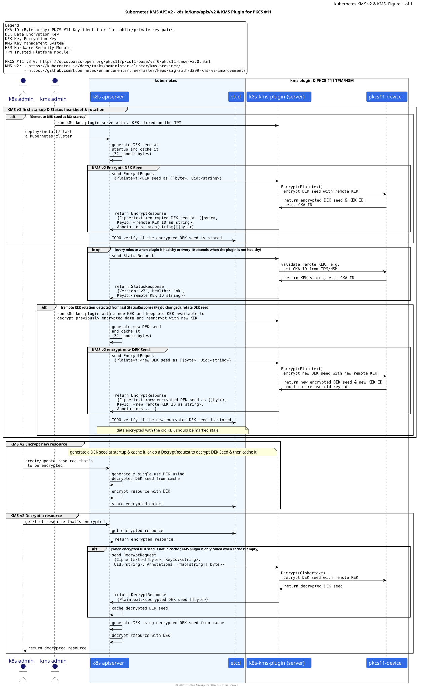
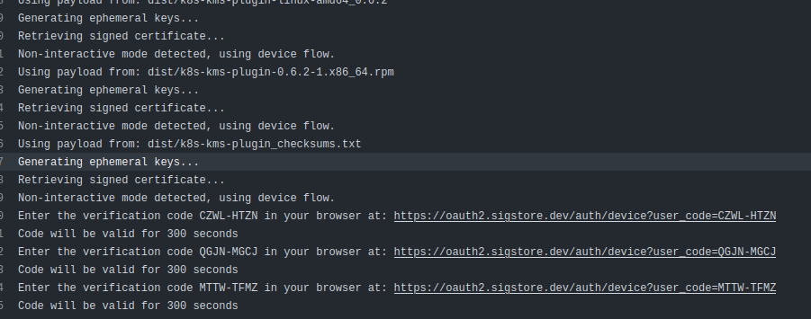
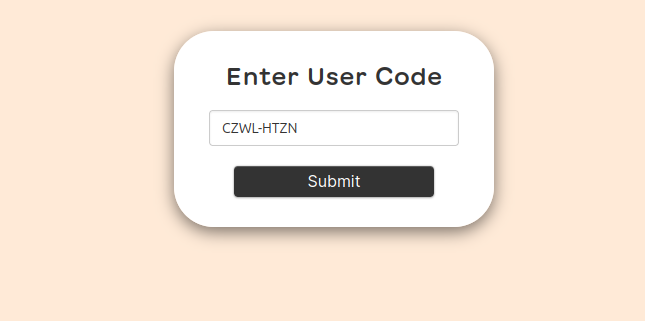

# K8S-KMS-Plugin

`k8s-kms-plugin` implements the [Kubernetes KMS v2 API](https://pkg.go.dev/k8s.io/kms/apis/v2) protocol as a gRPC service that leverages a remote or local HSM via PKCS11.

This plugin will also run in proxy mode which can connect to a remote plugin service running in a secure network device (Key Managers)

> **Droping support of KMS v1**: Newer version of the `k8s-kms-plugin` droped support for [Kubernetes KMSv1](https://pkg.go.dev/k8s.io/kms@v0.33.3/apis/v1beta1),
> as KMSv1 is deprecated in Kubernetes v1.28 and disabled by default since Kubernetes v1.29.

> **Note**: This documentation is under construction and needs to be updated to remove/archive references to KMS v1 and
> document KMS v2 operations.

- [1. Definions \& Accronyms](#1-definions--accronyms)
- [2. Overview](#2-overview)
  - [2.1. Architecture](#21-architecture)
  - [2.2. Deployment Scenarios Example](#22-deployment-scenarios-example)
- [3. Installation](#3-installation)
  - [3.1. kubernetes Requierments](#31-kubernetes-requierments)
  - [3.2. Install `k8s-kms-plugin` From Official Packages](#32-install-k8s-kms-plugin-from-official-packages)
    - [3.2.1. `apk` Alpine or Wolfi OS packages](#321-apk-alpine-or-wolfi-os-packages)
    - [3.2.2. `archlinux` packages](#322-archlinux-packages)
    - [3.2.3. `deb` debian packages](#323-deb-debian-packages)
    - [3.2.4. `rpm` RPM packages](#324-rpm-rpm-packages)
    - [3.2.5. Binary](#325-binary)
  - [3.3. Build `k8s-kms-plugin` locally from Source with `make`](#33-build-k8s-kms-plugin-locally-from-source-with-make)
    - [3.3.1. Build Requierments](#331-build-requierments)
    - [3.3.2. Standard x86 Linux Build](#332-standard-x86-linux-build)
    - [3.3.3. Debug x86 Linux Build](#333-debug-x86-linux-build)
  - [3.4. Build `k8s-kms-plugin` **locally** from Source with `goreleaser`](#34-build-k8s-kms-plugin-locally-from-source-with-goreleaser)
- [4. Usage \& User Guides](#4-usage--user-guides)
  - [4.1. CLI Help Messages](#41-cli-help-messages)
  - [4.2. CLI Auto Completion for `bash`, `fish`, `zsh`](#42-cli-auto-completion-for-bash-fish-zsh)
  - [4.3. CLI Auto Generated Documentation](#43-cli-auto-generated-documentation)
  - [4.4. User Input Priority: CLI \> Env Vars \> Config File \> Default](#44-user-input-priority-cli--env-vars--config-file--default)
- [5. KMS provider for SoftHsm V2](#5-kms-provider-for-softhsm-v2)
- [6. KMS provider for TPM2 PKCS11](#6-kms-provider-for-tpm2-pkcs11)
- [7. Quick Start](#7-quick-start)
- [8. Deployment scenarios](#8-deployment-scenarios)
- [9. Development Environment](#9-development-environment)
- [10. Debug Environment](#10-debug-environment)
- [11. Vulnerability check](#11-vulnerability-check)
- [12. Signing artifacts](#12-signing-artifacts)
- [13. Verifying the authenticity of an artifact](#13-verifying-the-authenticity-of-an-artifact)
- [14. Verifying the SLSA attestation of a container](#14-verifying-the-slsa-attestation-of-a-container)

## 1. Definions & Accronyms

| Term        | Definition                            |
|-------------|---------------------------------------|
| **DEK**     | Data Encryption Key                   |
| **HSM**     | Hardware Security Module              |
| **k3s**     | A Lightweight Kubernetes Distribution |
| **k8s**     | Kubernetes (short for)                |
| **KEK**     | Key Encryption Key                    |
| **KMS**     | Key Management System                 |
| **PKCS#11** | Public Key Cryptography Standard      |
| **TPM**     | Trusted Platform Module               |

## 2. Overview

### 2.1. Architecture

The following sequence diagram illustrates the communication between `kubernetes` ([KMS v2 API](https://pkg.go.dev/k8s.io/kms/apis/v2)), `k8s-kms-plugin`, and a [PKCS #11](https://docs.oasis-open.org/pkcs11/pkcs11-base/v3.0/pkcs11-base-v3.0.html) capable device like a TPM or HSM.

<details>
<summary>k8s-kms-plugin Sequence Diagram</summary>



</details>

> This diagram was inspired by those from https://github.com/kubernetes/enhancements/tree/master/keps/sig-auth/3299-kms-v2-improvements

### 2.2. Deployment Scenarios Example

The figure below illustrates several example of how the `k8s-kms-plugin` can be deployed for a Kubernetes Single Node cluster and using an embedded TPM or an HSM as a PKCS #11 capable key store.


## 3. Installation
### 3.1. kubernetes Requierments

`k8s-kms-plugin` is designed for kubernetes clusters that are using version v1.29 or higher and implements the [KMS v2 API](https://pkg.go.dev/k8s.io/kms/apis/v2). See also:
https://kubernetes.io/docs/tasks/administer-cluster/kms-provider/

`k8s-kms-plugin` **does not support KMS v1** which is deprecated in Kubernetes v1.28 and disabled by default since Kubernetes v1.29.

To serve the `k8s-kms-plugin` for encryption operations from Kubernetes, you will need at least one AES key in a PKCS11 provider.

### 3.2. Install `k8s-kms-plugin` From Official Packages

As of now, `k8s-kms-plugin`'s Github Action Build Recipe supports building `apk`, `deb`, `rpm` and `archlinux` for
Linux x86 platform. Check the different package artefacts from the [releases](https://github.com/ThalesGroup/k8s-kms-plugin/releases)
tab.

#### 3.2.1. `apk` Alpine or Wolfi OS packages

```bash
```

#### 3.2.2. `archlinux` packages

```bash
```

#### 3.2.3. `deb` debian packages

```bash
```

#### 3.2.4. `rpm` RPM packages

```bash
```

#### 3.2.5. Binary

```bash
```

### 3.3. Build `k8s-kms-plugin` locally from Source with `make`

#### 3.3.1. Build Requierments

You should have `make`, `git` and `go` installed. Review the content of the [`Makefile`](./Makefile) file for more details.

CGO is required to build the plugin: **make sure you are using the right C Library** (glibc or musl) for your target
environment. Do not build on musl libc if you intend to use the plugin on a non-musl environment (glibc).

Build was tested with:

```bash
make --version
```
```
GNU Make 4.4.1
Construit pour x86_64-pc-linux-gnu
Copyright (C) 1988-2023 Free Software Foundation, Inc.
License GPLv3+: GNU GPL version 3 or later <https://gnu.org/licenses/gpl.html>
This is free software: you are free to change and redistribute it.
There is NO WARRANTY, to the extent permitted by law.
```

```bash
go version
```
```
go version go1.23.9 linux/amd64
```

```bash
git version
```
```
git version 2.50.1
```

#### 3.3.2. Standard x86 Linux Build

Run

```bash
make build
```

You should get a `k8s-kms-plugin` binary in the current directory.

#### 3.3.3. Debug x86 Linux Build

Run

```bash
make build-debug
```

You should get a `k8s-kms-plugin` binary in the current directory.

### 3.4. Build `k8s-kms-plugin` **locally** from Source with `goreleaser`

This section allows you to locally test the [`goreleaser`](https://github.com/goreleaser/goreleaser) Github Action Build
Recipe. It generates the same artefacts that the one generated by the Github Action CICD pipeline, but locally.

These commands are executed in `bash`. If you use other shells like `fish`, you might need to adjust the environment
variables export.

```bash
export LDFLAGS=$(make get-ldflags)
export WORKSPACE=/pwd
export GITHUB_REPOSITORY_OWNER=localfakegithubowner
```

As of now, we choose to configure `.goreleaser.yml` so that `goreleaser` gets the content of `LDFLAGS` from an
environment variable. This allows us to use the same `LDFLAGS` for the `make` build procedure as well as the
`goreleaser` build, without having to set `LDFLAGS` twice (once in `.goreleaser.yml`, and once in `Makefile`.).

`goreleaser` will fail if you do not provide a value for `GITHUB_REPOSITORY_OWNER`. We suggest using a fake value.
During a real Github Action run, the value will be provided by the `GITHUB_REPOSITORY_OWNER` environment variable set
by GA.

`goreleaser` will fail if you do not provide a value for `WORKSPACE`. During a real Github Action run, the value will be
provided by GA.

Then you can either install and run `goreleaser` locally, or (preferably) you can use `podman` to run `goreleaser`
inside an interactive container. Below is the `podman` command to run `goreleaser` locally.

```bash
podman run -it --rm \
        -v $PWD:/pwd \
        --workdir /pwd \
        -e LDFLAGS=$LDFLAGS \
        -e WORKSPACE=$WORKSPACE \
        -e GITHUB_REPOSITORY_OWNER=$GITHUB_REPOSITORY_OWNER \
        --platform "linux/amd64" \
        ghcr.io/thalesgroup/goreleaser-glibc-image:golang-1.23.6-bookworm \
          release \
            --clean \
            --snapshot \
            --skip sign,publish,validate,ko,sbom
```

We use a custom [`ghcr.io/thalesgroup/goreleaser-glibc-image`](https://github.com/ThalesGroup/goreleaser-glibc-image/pkgs/container/goreleaser-glibc-image) image to build `k8s-kms-plugin`, because the default [`ghcr.io/goreleaser/goreleaser`](https://github.com/goreleaser/goreleaser/pkgs/container/goreleaser) container image does not use the standard `glibc` libraries,
but uses MUSL libc (found on Alpine Linux).
To run on standard linux (not musl), `k8s-kms-plugin` needs to use standard `glibc` libraries as CGO is enabled.

You can also check out [`ghcr.io/goreleaser/goreleaser-cross`](https://github.com/goreleaser/goreleaser-cross/pkgs/container/goreleaser-cross),
which supports standard `glibc`.

Or you can create your own custom image, based on the examples from https://github.com/ThalesGroup/goreleaser-glibc-image.

## 4. Usage & User Guides

TL;DR: The main commands you need are [`k8s-kms-plugin serve`](./docs/cli-user-interface/markdown/k8s-kms-plugin_serve.md) and [`k8s-kms-plugin serve rotation`](./docs/cli-user-interface/markdown/k8s-kms-plugin_serve_rotation.md).

### 4.1. CLI Help Messages

`k8s-kms-plugin` uses the [spf13/cobra](https://github.com/spf13/cobra) CLI framework to generate the help messages.
We recommend the user to use the `-h` and `--help` flags to get the help messages.

### 4.2. CLI Auto Completion for `bash`, `fish`, `zsh`

`k8s-kms-plugin` supports auto-completion for `bash`, `fish`, `zsh` shells. We recommend to use the auto-completion for
a better user experience.

Example for `fish`:

```bash
k8s-kms-plugin completion fish > ~/.config/fish/completions/k8s-kms-plugin.fish
```

### 4.3. CLI Auto Generated Documentation

A static version of the CLI documentation can be generated with the `docs` command:

```bash
$ ./k8s-kms-plugin docs -f cli-table-pretty -o docs/cli-user-interface/txt/
$ ./k8s-kms-plugin docs -f markdown -o docs/cli-user-interface/markdown/
```

A snapshot of the CLI documentation is available here [`docs/cli-user-interface/markdown/README.md`](./docs/cli-user-interface/markdown/README.md).

### 4.4. User Input Priority: CLI > Env Vars > Config File > Default

`k8s-kms-plugin` allows users to configure its settings through multiple sources, with the highest priority given to
CLI flags, followed by environment variables, and then configuration files.
The default settings are used if no other sources provide a value.

Each CLI flag (e.g. `--log-level`) has a corresponding environment variable (e.g. `KMS_K8S_PLUGIN_LOG_LEVEL`) and a config file entry (e.g. `log-level` in YAML/TOML/JSON).

A recap of all `k8s-kms-plugin` subcommands, flags, and environment variables is available here [`./docs/cli-user-interface/markdown/cli-env-var-table.md`](./docs/cli-user-interface/markdown/cli-env-var-table.md) or here [`./docs/cli-user-interface/txt/cli-env-var-table.txt`](./docs/cli-user-interface/txt/cli-env-var-table.txt) (txt).

| User Input Source        | Priority Order                  | Example                             |
|--------------------------|---------------------------------|-------------------------------------|
| 1️⃣ CLI Flag             | Highest priority                | `--log-level debug`                 |
| 2️⃣ Environment Variable | Overrides config file & default | `KMS_K8S_PLUGIN_LOG_LEVEL=trace`    |
| 3️⃣ Config File          | Overrides default               | `log-level: warn` in YAML/TOML/JSON |
| 4️⃣ Default Value        | Used if nothing else is set     | `info` (from Cobra init)            |

Flags are handled by [Cobra](https://github.com/spf13/cobra), environment variables, and config files are handled by
[Viper](https://github.com/spf13/viper) with some customizations [`viper-patch-sub.go`](./cmd/k8s-kms-plugin/cmd/viper-patch-sub.go)
to patch the binding between Cobra and Viper.


## 5. KMS provider for SoftHsm V2

In this mode, we recommend to run the `k8s-kms-plugin` with the GCM algorithm.
It provides a better design for authenticated encryption operations :

```sh
# debian
export MODULE="/usr/lib/softhsm/libsofthsm2.so"
# redhat
export MODULE="/usr/lib64/pkcs11/libsofthsm2.so"
# serve
k8s-kms-plugin serve \
  --provider p11 --p11-lib $MODULE --p11-key-label mykey --p11-label mylabel --p11-pin mypin --enable-server
```

## 6. KMS provider for TPM2 PKCS11

You must know that AES GCM is not supported by the TPM v2 specifications.
In this mode, we recommend to run the `k8s-kms-plugin` with the CBC-then-HMAC algorithm.
You must provide an HMAC key alongside the AES key for encryption :

```sh
# debian
export MODULE="/usr/lib/x86_64-linux-gnu/libtpm2_pkcs11.so.1"
# redhat
export MODULE="/usr/lib64/pkcs11/libtpm2_pkcs11.so"
# serve
k8s-kms-plugin serve \
  --provider p11 --p11-lib $MODULE --p11-key-label cbc0 --p11-hmac-label hmac0 --p11-label mylabel --p11-pin mypin --algorithm aes-cbc --enable-server
```

## 7. Quick Start

Read the [QUICKSTART.md](QUICKSTART.md).

## 8. Deployment scenarios

This plugin is designed to be deployed in 2 configurations

- Client/Server - `k8s-kms-plugin` in `client` mode will `enroll` to an external `k8s-kms-plugin` running in `serve` mode
- StandAlone(TODO) - Plugin and PKCS11 library deployed as StaticPod/HostContainer on APIServer nodes, this will require
coordination with k8s provisioning tools.

## 9. Development Environment

`k8s` houses some sample client and server deployments for e2e testing until such time as this plugin is 100% network functional,
 and we can move it to a CICD pattern, as we'll have many actors to coordinate.

All apis are defined in the `/apis` dir, and as we iterate on the spec docs, one must then run `make gen` and refactor
until the 2 stacks come up

Both EST and KMS-Plugin binaries are in the `/cmd` dir

The `Makefile` contains commands for easy execution:
- `make gen` - generates all apis into gRPC or OpenAPI Servers and Clients
- `make dev` - loads project into your kubernetes cluster (minikube or GKE will work just fine), and continuously builds and deploys as you develop.
- `make build` - builds the standalone `k8s-kms-plugin` binary

If you need to build using `crypto11` and `gose` development branches :

1. Push your dev modifications in a dedicated branch in the `crypto11` repo (ex: my-dev-branch)
2. Go to the `gose` repo and update the *go.mod* file with `crytpo11` dev branch and push the update :

```sh
# In gose repo
# in a dev branch
go switch -c my-dev-branch
GOPROXY=direct go get -u github.com/ThalesGroup/crypto11@my-dev-branch
go mod tidy
git add go.mod
git commit -S -s -m "dev: update gose with crytpo11 dev changes"
git push
```

3. Go to the `k8s-kms-plugin` repo and update the *go.mod* file with `crytpo11` and `gose` dev branches, then build :

```sh
go switch -c my-dev-branch
GOPROXY=direct go get -u github.com/ThalesGroup/crypto11@my-dev-branch
GOPROXY=direct go get -u github.com/ThalesGroup/gose@my-dev-branch
go mod tidy
make build
```

## 10. Debug Environment

For a remote debug, build the plugin with debug mode :

```sh
go get github.com/go-delve/delve/cmd/dlv
make build-debug
```

It will generate a binary `k8s-kms-plugin` that can be used with Delve for debug purpose.
Do not use this binary in a production environment.

## 11. Vulnerability check

```sh
$ govulncheck ./...
Scanning your code and 288 packages across 34 dependent modules for known vulnerabilities...

No vulnerabilities found.
```

## 12. Signing artifacts

During the release workflow, certificates and signatures of artifacts are generated.
They are signed by a tool named cosign using a keyless mode.
It required an authentication by clicking in links present in logs.



Once you click on one, you can submit a verification code that will redirect you to three types of authentication. Then click on Github authentication.

 

Do these actions for every authentication links and the signatures and the certificates will be generated with the artifacts in the release.

## 13. Verifying the authenticity of an artifact

You need to downloads 3 files : [ _**[file.txt]**_, _**[file].pem**_, _**[file].sig**_]

If you don't have, install cosign by typing the commands below :

  ```bash
  curl -O -L "https://github.com/sigstore/cosign/releases/latest/download/cosign-linux-amd64"
  sudo mv cosign-linux-amd64 /usr/local/bin/cosign
  sudo chmod +x /usr/local/bin/cosign
  ```

For a verification with cosign installed and pay attention to modify the name of the files :

  ```bash
  COSIGN_EXPERIMENTAL=1 cosign verify-blob --cert [file]-keyless.pem --signature [file]-keyless.sig --certificate-oidc-issuer "https://github.com/login/oauth" --certificate-identity [ Mail adress of the owner of the repo ] [file]
  ```

Or using Podman without installing cosign :

```bash
podman run --rm -it gcr.io/projectsigstore/cosign:v1.13.0 COSIGN_EXPERIMENTAL=1 cosign verify-blob --cert [file]-keyless.pem --signature [file]-keyless.sig --certificate-oidc-issuer "https://github.com/login/oauth" --certificate-identity [ Mail adress of the owner of the repo ] [file]
```

## 14. Verifying the SLSA attestation of a container

The image's attestation of provenance has been issued by a specific oidc-issuer that is 'https://token.actions.githubusercontent.com' in this repository.
In the next command example, it is required to replace digest by the digest of the image that needs to be verified and the owner of the repo.

```bash
cosign verify-attestation --type slsaprovenance \
      --certificate-identity-regexp="https://github.com/slsa-framework/slsa-github-generator/.github/workflows/generator_container_slsa3.yml@refs/tags/*" \
      --certificate-oidc-issuer="https://token.actions.githubusercontent.com" \
      ghcr.io/OWNER/k8s-kms-plugin@digest | jq .payload -r | base64 --decode | jq

```
