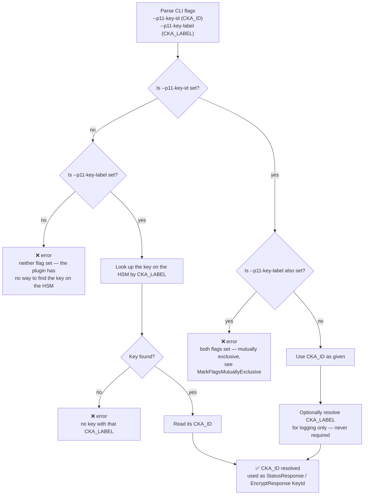

Every key `k8s-kms-plugin` uses on the HSM — the KEK, and the HMAC key for `aes-cbc` — is identified
by two independent PKCS #11 attributes, and the CLI lets you name a key by either one:

| Attribute            | Type                    | Role                                                                              |
|-----------------------|--------------------------|------------------------------------------------------------------------------------|
| `CKA_ID`    | byte array               | The **canonical identifier**. It is what the plugin sends back as `StatusResponse.KeyId` / `EncryptResponse.KeyId`, and what `kube-apiserver` then stores as `key_id` next to every encrypted object in etcd. It must exist and be stable for the life of the KEK. |
| `CKA_LABEL` | RFC 2279 UTF-8 string (default empty) | A **human-friendly name**, useful for `pkcs11-tool` output and log lines. It is never sent over the KMS v2 API and never stored in etcd. |

This is why the two are not symmetric alternatives, even though the CLI accepts either one:
`CKA_ID` is what the protocol actually needs, and `CKA_LABEL` is only ever a convenience for looking
one up.

## How `--p11-key-id` / `--p11-key-label` are resolved

Both `k8s-kms-plugin serve` and `k8s-kms-plugin serve rotation` apply this resolution independently
per key: the active KEK (`--p11-key-id`/`--p11-key-label`), the HMAC key used by `aes-cbc`
(`--p11-hmac-id`/`--p11-hmac-label`), and, under `serve rotation`, the old KEK and old HMAC key
(`--old-p11-key-id`/`--old-p11-key-label`, `--old-p11-hmac-id`/`--old-p11-hmac-label`). In every case
exactly one of the ID/LABEL pair must be given
([`MarkFlagsOneRequired`](https://pkg.go.dev/github.com/spf13/cobra#Command.MarkFlagsOneRequired)),
and both may not be given at once
([`MarkFlagsMutuallyExclusive`](https://pkg.go.dev/github.com/spf13/cobra#Command.MarkFlagsMutuallyExclusive)) —
this prevents a user-provided `CKA_ID` and `CKA_LABEL` from silently referring to two different keys.

See [`k8s-kms-plugin serve`](./markdown/k8s-kms-plugin_serve.md) and
[`k8s-kms-plugin serve rotation`](./markdown/k8s-kms-plugin_serve_rotation.md) for the full flag
reference, and [`FindCkaAttrByIDOrLabel`](https://github.com/eclipse-keysealer/k8s-kms-plugin/blob/master/pkg/providers/p11.go) / `GetKeyIDAndLabel` in
`pkg/providers/p11.go` for the implementation.

PKCS #11 v3.2: <https://docs.oasis-open.org/pkcs11/pkcs11-base/v3.2/pkcs11-base-v3.2.html>
