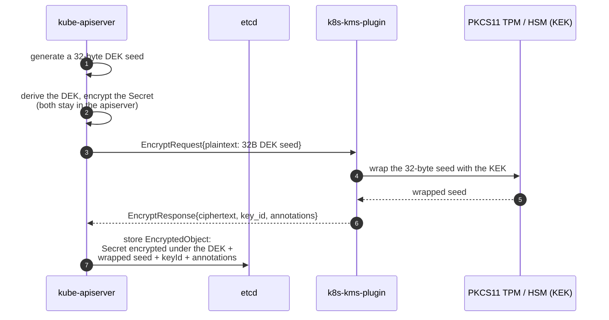

# Cryptographic Schemes 🔐

This page documents, for each `--algorithm-family` value, exactly what `k8s-kms-plugin` does to the
data `kube-apiserver` sends it: which keys it uses, which primitives it composes, what the resulting
ciphertext looks like on the wire, and which operations happen inside the HSM.

It is a reference page. For *how to provision* a key of a given family see the
[HSM & TPM guides](./README.md#3-hsm--tpm-guides); for *how to run* the plugin see
[`k8s-kms-plugin serve`](./cli-user-interface/markdown/k8s-kms-plugin_serve.md).

- [1. What the plugin actually encrypts](#1-what-the-plugin-actually-encrypts)
- [2. The KMS v2 wire contract](#2-the-kms-v2-wire-contract)
- [3. Algorithm families at a glance](#3-algorithm-families-at-a-glance)
- [4. `aes-gcm`](#4-aes-gcm)
- [5. `aes-cbc`](#5-aes-cbc)
- [6. `rsa-oaep`](#6-rsa-oaep)
- [7. `ml-kem`](#7-ml-kem)
  - [7.1. Vocabulary](#71-vocabulary)
  - [7.2. A KEM is not a public-key encryption scheme](#72-a-kem-is-not-a-public-key-encryption-scheme)
  - [7.3. Construction](#73-construction)
  - [7.4. Why the KEM ciphertext does not live in `ciphertext`](#74-why-the-kem-ciphertext-does-not-live-in-ciphertext)
  - [7.5. Is it safe to put the KEM ciphertext in a plaintext annotation?](#75-is-it-safe-to-put-the-kem-ciphertext-in-a-plaintext-annotation)
  - [7.6. What binds the annotation to the envelope](#76-what-binds-the-annotation-to-the-envelope)
- [8. What stays inside the HSM](#8-what-stays-inside-the-hsm)
- [9. References](#9-references)

## 1. What the plugin actually encrypts

`k8s-kms-plugin` never sees your `Secret` data. Kubernetes KMS v2 is an *envelope* scheme:



So the **plaintext the plugin receives is always 32 bytes of key material**, and the KEK it wraps
that seed with is the object living on the HSM. Every scheme below is a way of wrapping 32 bytes.

Two consequences worth keeping in mind while reading:

- Ciphertext sizes are essentially constant per family — they do not grow with your `Secret` sizes.
- The apiserver caches DEKs, so an `Encrypt` RPC does not happen on every write.

## 2. The KMS v2 wire contract

Four constraints from [`k8s.io/kms/apis/v2/api.proto`](https://pkg.go.dev/k8s.io/kms/apis/v2) shape
every scheme on this page — their rationale is in
[KEP-3299](https://github.com/kubernetes/enhancements/tree/master/keps/sig-auth/3299-kms-v2-improvements),
and the apiserver side of the contract in the
[Kubernetes KMS provider guide](https://kubernetes.io/docs/tasks/administer-cluster/kms-provider/):

| Constraint                        | Value                                                            | Consequence for this plugin                                                                              |
|-----------------------------------|------------------------------------------------------------------|----------------------------------------------------------------------------------------------------------|
| `EncryptResponse.ciphertext` size | **< 1 kB**, non-empty                                            | The binding constraint for `ml-kem` — see [§7.4](#74-why-the-kem-ciphertext-does-not-live-in-ciphertext) |
| `annotations` key format          | Fully qualified domain name (RFC 1123)                           | Keys are namespaced under `k8s-kms-plugin.keysealer.eclipse.org`                                         |
| `annotations` total size          | **< 32 kB** (keys + values)                                      | Leaves ample room for a 1568-byte ML-KEM ciphertext                                                      |
| `annotations` confidentiality     | *"stored in plaintext in etcd… no guarantees against tampering"* | Only non-secret material may go there                                                                    |

Annotations set on an `EncryptResponse` are stored beside the ciphertext and handed back **verbatim**
on the matching `DecryptRequest`. That round-trip is the only side channel KMS v2 offers a plugin,
and `ml-kem` is the one family that needs it.

The plugin sets one annotation on **every** `EncryptResponse`, regardless of family:

| Annotation key                                          | Value                    | Purpose                            |
|---------------------------------------------------------|--------------------------|------------------------------------|
| `algorithm-family.k8s-kms-plugin.keysealer.eclipse.org` | e.g. `aes-gcm`, `ml-kem` | Informational / observability only |

> 📌 `algorithm-family` is **not** used for dispatch. On `Decrypt` the plugin routes on its own
> configured `--algorithm-family`, not on the annotation, so a missing or altered value cannot
> change how a ciphertext is interpreted.

## 3. Algorithm families at a glance

| Family                    | HSM key(s) required                         | Output in `ciphertext` | Key wrapping                | Content encryption         |
|---------------------------|---------------------------------------------|------------------------|-----------------------------|----------------------------|
| [`aes-gcm`](#4-aes-gcm)   | 1 × AES (128/192/256-bit)                   | JWE Compact            | none — *direct*             | AES-GCM                    |
| [`aes-cbc`](#5-aes-cbc)   | 1 × AES-256 **+** 1 × generic secret (HMAC) | JWE Compact            | none — *direct*             | AES-256-CBC + HMAC-SHA-256 |
| [`rsa-oaep`](#6-rsa-oaep) | 1 × RSA key pair                            | JWE Compact            | RSAES-OAEP (SHA-256)        | AES-256-GCM                |
| [`ml-kem`](#7-ml-kem)     | 1 × ML-KEM key pair                         | Binary envelope (60 B) | ML-KEM encapsulation + KMAC | AES-GCM (128/256-bit)      |

Key size and ML-KEM parameter set are **derived at runtime from the key found on the HSM** — there is
no flag to set them. Provision the key you want and the plugin adapts.

Each family section below ends with a collapsible **real `EncryptResponse`**, captured against a
SoftHSMv3 dev token with [`scripts/grpcurl/collect-jwe-samples.sh`](../scripts/grpcurl/). Two things
to keep in mind when reading them:

- `ciphertext` and the annotation values are protobuf `bytes`, so `grpcurl` renders them
  **base64-encoded** — roughly 4/3 the size of the bytes the KMS v2 limits actually apply to.
- The long values are elided; the plugin's own `key_id` values (`"01"`, `"04"`, …) are just the
  `CKA_ID`s of that dev token.

## 4. `aes-gcm`

The simplest family: the AES key on the HSM *is* the content encryption key.

**Construction**

1. Find the AES key by `CKA_ID` / `CKA_LABEL`.
2. Read its `CKA_VALUE_LEN` to pick `A128GCM`, `A192GCM` or `A256GCM`.
3. Generate a 96-bit IV. Where it comes from depends on `--provider`: for `luna` / `dpod` the HSM
   supplies it during the GCM operation; for `p11` / `softhsm` it comes from the AEAD key's own
   nonce generator. This is a vendor behaviour, not a user-facing switch.
4. AES-GCM-seal the DEK seed **inside the HSM**, with the marshalled JWE header as AAD.
5. Serialise as a JWE and return it in `ciphertext`.

**JWE header**

```json
{ "alg": "dir", "kid": "05", "enc": "A256GCM" }
```

`alg: dir` is [RFC 7518 §4.5](https://datatracker.ietf.org/doc/html/rfc7518#section-4.5) direct
encryption: there is no wrapped key, the shared symmetric key is used directly.

> ⚠️ **Interoperability**: the serialisation produced here is the *legacy* gose JWE layout, not a
> strictly RFC 7516-compliant Compact Serialization. These ciphertexts are meant to be read back by
> `k8s-kms-plugin`, not by a third-party JOSE library.

<details>
<summary>📋 Sample <code>EncryptResponse</code> — <code>aes-gcm</code>, key <code>dev-aes-gcm-kek</code></summary>

`ciphertext` is **162 B** — 16% of the 1 kB limit, the smallest of the JWE families.

```json
{
  "ciphertext": "ZXlKaGJHY2lPaUprYVhJaUxDSnJhV1Fp…<216 chars total, middle elided>… bUh5UUd5NG1HZmVR",
  "keyId": "01",
  "annotations": {
    "algorithm-family.k8s-kms-plugin.keysealer.eclipse.org": "YWVzLWdjbQ=="
  }
}
```

`YWVzLWdjbQ==` decodes to `aes-gcm`. Base64-decoding `ciphertext` once yields the JWE Compact
Serialization whose protected header is the one shown above.

</details>

## 5. `aes-cbc`

AES-CBC has no built-in authentication, so this family pairs it with an HMAC — and therefore needs
**two** HSM objects.

**Construction**

1. Find the AES-256 key (`CKA_ID` / `CKA_LABEL`) **and** the HMAC key (`--p11-hmac-id` /
   `--p11-hmac-label`; `--old-p11-hmac-id` / `--old-p11-hmac-label` under `serve rotation`).
2. Generate an IV of one AES block (16 bytes) from the HSM RNG.
3. Encrypt the DEK seed with AES-256-CBC **inside the HSM**.
4. Authenticate with `CKM_SHA256_HMAC` **inside the HSM**, following the
   [RFC 7516 Appendix B](https://datatracker.ietf.org/doc/html/rfc7516#appendix-B) AES-CBC-HMAC
   composition.
5. Serialise as a JWE and return it in `ciphertext`.

**JWE header**

```json
{ "alg": "A256CBC", "kid": "06", "typ": "JWT", "cty": "JWT", "enc": "A256CBC" }
```

**Notes**

- **AES-256 only.** `A256CBC` is the only AES-CBC key size gose exposes for JWE, so a 128- or
  192-bit CBC key on the HSM will not work. AES-GCM has no such restriction.
- The `alg` header carries the key algorithm rather than `dir`, which is not what RFC 7516 expects;
  same interoperability caveat as [§4](#4-aes-gcm).
- The plaintext length is carried in a custom header field so the HMAC input can be reconstructed
  identically at decryption time.

<details>
<summary>📋 Sample <code>EncryptResponse</code> — <code>aes-cbc</code>, key <code>dev-aes-cbc-kek</code></summary>

`ciphertext` is **261 B** — 25% of the 1 kB limit; larger than `aes-gcm` because the JWE carries a
full 16-byte IV, CBC block padding and a separate HMAC tag.

```json
{
  "ciphertext": "ZXlKaGJHY2lPaUpCTWpVMlEwSkRJaXdp…<348 chars total, middle elided>… RGFIRVZONG8zWTFB",
  "keyId": "02",
  "annotations": {
    "algorithm-family.k8s-kms-plugin.keysealer.eclipse.org": "YWVzLWNiYw=="
  }
}
```

The decoded protected header of this capture is the one shown above plus a custom
`"_thales_aad": "AAAAAAAAACA"` field — that is the length header noted above, which lets the HMAC
input be rebuilt identically at decryption time.

</details>

## 6. `rsa-oaep`

The only classical family where the plugin holds a *key pair* rather than a shared secret, and the
only one that wraps a freshly generated content encryption key.

**Construction (encrypt)**

1. Find the RSA key pair on the HSM and take its **public** key.
2. Generate a random 256-bit CEK.
3. Wrap the CEK with RSAES-OAEP using **SHA-256**.
4. Generate a 96-bit IV, then AES-256-GCM-seal the DEK seed under the CEK, with the marshalled
   protected header as AAD.
5. Serialise as a JWE and return it in `ciphertext`.

**Construction (decrypt)** — the CEK is unwrapped **inside the HSM** with the private key
(`CKM_RSA_PKCS_OAEP`); the AES-GCM open then happens in the plugin under the recovered CEK.

**JWE header**

```json
{ "alg": "RSA-OAEP-256", "kid": "07", "typ": "JWT", "cty": "JWT", "enc": "A256GCM" }
```

[RFC 7518 §4.3](https://datatracker.ietf.org/doc/html/rfc7518#section-4.3) defines `RSA-OAEP` as
RSAES-OAEP with **SHA-1** and `RSA-OAEP-256` as the SHA-256 variant. Since gose
[`v1.0.0-rc2`](https://github.com/eclipse-keypont/gose/commit/50419eb24a2869c13e35a4a101bb70a8b72f82f1)
the header names the digest actually used, so — unlike the two AES families — **these JWEs are
portable**: a conformant RFC 7518 recipient can unwrap the CEK.

> 📌 **Reading data written before the upgrade.** Objects encrypted by earlier versions carry
> `RSA-OAEP` in the header while the CEK is SHA-256-wrapped. The plugin therefore passes an
> explicit `crypto.SHA256` to `Decrypt` rather than `crypto.Hash(0)` (which would derive the digest
> from the header and fail on exactly those objects). Both old and new ciphertexts decrypt, and
> **no re-encryption is required**. The protected header is the AEAD's additional authenticated
> data, so old headers cannot be rewritten in place even in principle.

**Size**: the wrapped CEK is one RSA modulus — 256 bytes for RSA-2048, 512 bytes for RSA-4096 —
which is what dominates the ciphertext length. RSA-4096 leaves noticeably less headroom under the
1 kB limit than RSA-2048. Measured on a SoftHSMv3 dev token:

| RSA key size | wrapped CEK (raw) | on the wire (base64url) | `EncryptResponse.ciphertext` | % of the 1 kB limit |
|--------------|-------------------|-------------------------|------------------------------|---------------------|
| RSA-2048     | 256 B             | 342 B                   | 607 B                        | 59%                 |
| RSA-3072     | 384 B             | 512 B                   | 777 B                        | 76%                 |
| RSA-4096     | 512 B             | 683 B                   | 948 B                        | 93%                 |

Every row carries the same 265 B of JWE framing (protected header, IV, ciphertext and tag
segments); the wrapped CEK is the only part that grows with the key size, and base64url inflates it
by ≈1.333× on the way into the JWE Encrypted Key segment.

> ⚠️ **RSA-4096 is close to the ceiling.** At 93% there is ~76 B of headroom, and the figure is
> driven by the modulus plus base64url expansion, not by anything configurable. This is the one
> classical family where the KMS v2 1 kB cap is a real constraint.

<details>
<summary>📋 Sample <code>EncryptResponse</code> — <code>rsa-oaep</code>, key <code>dev-rsa-2048-oaep</code></summary>

```json
{
  "ciphertext": "ZXlKaGJHY2lPaUpTVTBFdFQwRkZVQzB5…<812 chars total, middle elided>… SlZ5bndwV3I1UQ==",
  "keyId": "04",
  "annotations": {
    "algorithm-family.k8s-kms-plugin.keysealer.eclipse.org": "cnNhLW9hZXA="
  }
}
```

`ZXlKaGJHY2lPaUpTVTBFdFQwRkZVQzB5` decodes to `eyJhbGciOiJSU0EtT0FFUC0y`, i.e. the JWE protected
header opening `{"alg":"RSA-OAEP-2` — the corrected label, visible in the first few bytes of the
response.

Note the `kid` in the decoded JWE header of this capture is a 64-hex-character key identifier
(`5d5229d7…2f58d4db`), not the short `CKA_ID` used as `key_id` — the two are independent.

</details>

## 7. `ml-kem`

The post-quantum family, standardised in [FIPS 203](https://doi.org/10.6028/NIST.FIPS.203)
(*Module-Lattice-Based Key-Encapsulation Mechanism Standard*, derived from CRYSTALS-Kyber).
This is the one family that does **not** produce a JWE.

### 7.1. Vocabulary

ML-KEM has its own vocabulary, and this plugin uses FIPS 203's terms rather than the RSA-style ones:

| FIPS 203 term        | Symbol | Classical analogue | Size (ML-KEM-1024) |
|----------------------|--------|--------------------|--------------------|
| encapsulation key    | `ek`   | public key         | 1568 B             |
| decapsulation key    | `dk`   | private key        | 3168 B             |
| **(KEM) ciphertext** | `c`    | wrapped key        | **1568 B**         |
| shared secret key    | `K`    | —                  | 32 B               |

Sizes for all three parameter sets, from FIPS 203 Table 3:

| Parameter set | encapsulation key | decapsulation key | ciphertext | shared secret key |
|---------------|-------------------|-------------------|------------|-------------------|
| ML-KEM-512    | 800 B             | 1632 B            | 768 B      | 32 B              |
| ML-KEM-768    | 1184 B            | 2400 B            | 1088 B     | 32 B              |
| ML-KEM-1024   | 1568 B            | 3168 B            | 1568 B     | 32 B              |

> 📌 **Why "ciphertext" twice?** FIPS 203 calls the output of `ML-KEM.Encaps` a *ciphertext*, and
> KMS v2 calls the plugin's output a *ciphertext*. They are different things. Throughout this
> plugin, **KEM ciphertext** always means FIPS 203's `c`, and it is carried in the
> `kem-ciphertext` annotation — never in `EncryptResponse.ciphertext`.

### 7.2. A KEM is not a public-key encryption scheme

`ML-KEM.Encaps(ek)` takes **no plaintext**. Per FIPS 203 Algorithm 20, it consumes randomness and
outputs a *pair*:

```
(K, c) ← ML-KEM.Encaps(ek)      K = 32-byte shared secret key
                                c = KEM ciphertext (1568 B for ML-KEM-1024)
```

You cannot hand it the DEK seed. So the plugin must build a hybrid construction: derive a symmetric
key from `K`, and use an AEAD to actually seal the seed. That produces **two artifacts** — and both
must reach `Decrypt`.

### 7.3. Construction

**Encrypt**

1. Find the ML-KEM key pair on the HSM by `CKA_ID` / `CKA_LABEL`; its parameter set fixes everything
   downstream.
2. The HSM performs `ML-KEM.Encaps(ek)` → the KEM ciphertext `c`, plus `K` as a transient AES session
   object.
3. Extract `K` and derive an AES key with KMAC ([NIST SP 800-185](https://doi.org/10.6028/NIST.SP.800-185)):

   | Parameter set | KMAC variant | Derived key |
   |---------------|--------------|-------------|
   | ML-KEM-512    | KMAC128      | 128-bit     |
   | ML-KEM-768    | KMAC256      | 256-bit     |
   | ML-KEM-1024   | KMAC256      | 256-bit     |

   The parameter set name is mixed into the KMAC context string for domain separation, so a key
   derived under one parameter set can never collide with another.
4. Generate a 96-bit nonce from the HSM RNG.
5. AES-GCM-seal the DEK seed under the derived key, with `"k8s-kms-plugin/ml-kem/v1" || c` as the
   additional authenticated data — see [§7.6](#76-what-binds-the-annotation-to-the-envelope).
6. Emit the envelope.

**Decrypt** is the mirror image: read `c` from the annotation, resolve the decapsulation key from
`DecryptRequest.key_id`, let the HSM perform `ML-KEM.Decaps(dk, c)` → the same `K`, re-derive the
same AES key, rebuild the same AAD, and open the AEAD. Because the key pair is resolved from
`key_id`, the rotation server can decrypt objects written under the previous KEK.

**Wire format**

`EncryptResponse.ciphertext` — a plain binary envelope, **60 bytes**, constant across parameter sets:

```
┌────────────────┬──────────────────────────┬──────────────┐
│ nonce (12 B)   │ AES-GCM(DEK seed) (32 B) │ tag (16 B)   │
└────────────────┴──────────────────────────┴──────────────┘
                                             ▲
     the tag also covers the AAD ────────────┘
     "k8s-kms-plugin/ml-kem/v1" || c   (authenticated, not stored)
```

The AAD is not part of the envelope — it is reconstructed at decryption time from the context
string and the annotation, so it costs no bytes on the wire.

`EncryptResponse.annotations`:

| Annotation key                                          | Value                       | Size (ML-KEM-1024) |
|---------------------------------------------------------|-----------------------------|--------------------|
| `kem-ciphertext.k8s-kms-plugin.keysealer.eclipse.org`   | the KEM ciphertext `c`, raw | 1568 B             |
| `algorithm-family.k8s-kms-plugin.keysealer.eclipse.org` | `ml-kem`                    | 6 B                |

Total annotation footprint is **1678 B** — keys (104 B) plus values (1574 B) — or **5% of the 32 kB
budget**. ML-KEM-768 uses 1198 B and ML-KEM-512 uses 878 B.

> 📐 The `annotations` limit applies to protobuf `bytes`, which is what those figures count. A
> `grpcurl` capture renders the same annotations as base64 and so reads larger — 2204 B for
> ML-KEM-1024 — so do not read the sample captures below as sizes against the limit.
> `collect-jwe-samples.sh` reports the decoded figure.

<details>
<summary>📋 Sample <code>EncryptResponse</code> — <code>ml-kem</code>, key <code>dev-ml-kem-1024</code></summary>

```json
{
  "ciphertext": "w7k491qJEvGGJFLLgQN+LmIz1v0zBnMNGy9Yl+P0oOuLAXTtV/C3jpcXXy/2CwSBUe6bxN9o3YHyzcuO",
  "keyId": "09",
  "annotations": {
    "algorithm-family.k8s-kms-plugin.keysealer.eclipse.org": "bWwta2Vt",
    "kem-ciphertext.k8s-kms-plugin.keysealer.eclipse.org": "pElZiVZYiRs/pXPkJBmgpVR91AJlhso9…<2092 chars total, middle elided>… 7HSDe7H7d25wKqw="
  }
}
```

This is the whole scheme in one message. `ciphertext` is shown in full — 80 base64 characters, i.e.
exactly the **60 bytes** of the envelope, and identical in length for all three parameter sets.
`bWwta2Vt` decodes to `ml-kem`. The `kem-ciphertext` value is 2092 base64 characters, which is the
**1568 raw bytes** of the FIPS 203 ciphertext `c` for ML-KEM-1024 — on its own more than the entire
1 kB `ciphertext` budget, which is precisely why it lives in an annotation ([§7.4](#74-why-the-kem-ciphertext-does-not-live-in-ciphertext)).

The 60-byte `ciphertext` and the parameter-set-sized annotation, per parameter set:

| Parameter set | `ciphertext` | `kem-ciphertext` annotation (raw) |
|---------------|--------------|-----------------------------------|
| ML-KEM-512    | 60 B         | 768 B                             |
| ML-KEM-768    | 60 B         | 1088 B                            |
| ML-KEM-1024   | 60 B         | 1568 B                            |

</details>

> 📌 The parameter set is deliberately **not** recorded on the wire. It is recovered from the HSM key
> pair at decryption time, so an attacker cannot influence it by editing an annotation.

### 7.4. Why the KEM ciphertext does not live in `ciphertext`

Because it does not fit. `EncryptResponse.ciphertext` is capped at 1 kB:

| Parameter set | KEM ciphertext | + 60 B envelope | Fits under 1 kB? |
|---------------|----------------|-----------------|------------------|
| ML-KEM-512    | 768 B          | 828 B           | ✅                |
| ML-KEM-768    | 1088 B         | 1148 B          | ❌                |
| ML-KEM-1024   | 1568 B         | 1628 B          | ❌                |

Only the weakest parameter set would fit, and only barely. A single layout across all three is worth
more than saving one annotation for ML-KEM-512, so the plugin always splits.

This is also why `ml-kem` produces no JWE: a JWE Compact Serialization has one payload slot and
base64url-encodes it, which would push ML-KEM-1024 to roughly 2 kB — twice the limit.

The annotation avoids that expansion entirely. Annotations are protobuf `bytes`, so the KEM
ciphertext travels **raw**; a cryptogram in the JWE Encrypted Key segment is base64url-encoded once.
Measured across the sample set:

| Carrier                                                     | Raw                 | On the wire       | Expansion   |
|-------------------------------------------------------------|---------------------|-------------------|-------------|
| `annotations.kem-ciphertext` (`ml-kem`, all parameter sets) | 768 / 1088 / 1568 B | same              | **1.000×**  |
| `jwe.encrypted-key` (`rsa-oaep`, 2048 / 3072 / 4096)        | 256 / 384 / 512 B   | 342 / 512 / 683 B | **≈1.333×** |

So the split does not merely move the KEM ciphertext out of a field that is too small — it also
stops it being inflated by a third on the way there.

There is a second, more fundamental reason. **There is currently no standards-track way to express
ML-KEM in JOSE at all**: `draft-ietf-jose-pqc-kem-06` dropped JOSE from its scope and was retitled
*"PQ KEMs for COSE"*. gose accordingly removed its ML-KEM support in
[`v1.0.0`](https://github.com/eclipse-keypont/gose) rather than ship a bespoke, non-interoperable
JWE envelope. The plugin's binary envelope is deliberately *not* dressed up as a JWE: it makes no
interoperability claim it could not honour, and it can be replaced wholesale once a JOSE-side draft
exists.

The remaining alternatives were rejected:

- **`key_id`** — also capped at 1 kB, and it identifies the KEK for staleness detection and
  rotation. Overloading it would break both.
- **Caching one encapsulation and reusing `K`** — reintroduces server-side state into a
  deliberately stateless per-object contract, and the apiserver already caches DEKs.

### 7.5. Is it safe to put the KEM ciphertext in a plaintext annotation?

Yes. `c` is key-establishment material, not payload — it carries no plaintext, and ML-KEM is
IND-CCA2 secure, so publishing `c` reveals nothing without the decapsulation key. Annotations being
world-readable in etcd is therefore not a confidentiality problem here.

Tampering is handled too, by two independent mechanisms — see
[§7.6](#76-what-binds-the-annotation-to-the-envelope).

### 7.6. What binds the annotation to the envelope

The KEM ciphertext lives in an annotation, and the KMS v2 contract is explicit that annotations are
*"stored in plaintext in etcd"* with *"no guarantees against tampering"*. Two independent mechanisms
make a substituted `c` fail closed:

1. **The KDF.** `ML-KEM.Decaps` on a different `c` returns a *different* shared secret — FIPS 203
   uses implicit rejection rather than signalling an error — which derives a different AES key, so
   the tag check fails.
2. **The AAD.** The plugin seals the envelope with `"k8s-kms-plugin/ml-kem/v1" || c` as AES-GCM
   additional authenticated data: data covered by the authentication tag but not encrypted.
   `Open` only succeeds if those exact bytes are reproduced.

Mechanism 1 alone would already be sound, so the AAD is defence in depth rather than a fix. It earns
its place by making the binding a property of the **format** instead of a side effect of the fact
that the KEM ciphertext happens to be the only annotation feeding the KDF. Any annotation added later
that influences decryption — a KDF version, a second KEM for a hybrid mode — would not be covered by
mechanism 1 unless it were also mixed into the derivation; the AAD is where it belongs instead.

The version suffix in the context string domain-separates the envelope format: bump it on any change
to the binary layout, the KDF, or the AAD's field set, and a mismatched reader gets a clean
authentication failure rather than silent misinterpretation.

> ⚠️ **This is a data-at-rest format change.** Envelopes sealed before the AAD was introduced were
> sealed with no AAD and will not open once it is required. It landed while `ml-kem` was pre-GA, so
> nothing outside release candidates is affected.

The end-to-end behaviour is covered by `TestMLKEM_TamperedKemCiphertextAnnotation`, which flips one
bit of the annotation and asserts the decrypt fails while the untouched response still succeeds. It
cannot attribute the failure to the AAD specifically — no real KEM lets you hold the derived key
constant while changing `c` — so `TestMlkemAAD_BindsEnvelopeToKemCiphertext` isolates that as a unit
test against a fixed AES-GCM key.

## 8. What stays inside the HSM

| Family     | Never leaves the HSM   | Performed inside the HSM | Present in plugin memory                               |
|------------|------------------------|--------------------------|--------------------------------------------------------|
| `aes-gcm`  | AES key                | AES-GCM seal / open      | plaintext DEK seed                                     |
| `aes-cbc`  | AES key, HMAC key      | AES-CBC, HMAC-SHA-256    | plaintext DEK seed                                     |
| `rsa-oaep` | RSA private key        | OAEP unwrap of the CEK   | CEK, plaintext DEK seed                                |
| `ml-kem`   | decapsulation key `dk` | `Encaps` / `Decaps`      | shared secret `K`, derived AES key, plaintext DEK seed |

The `ml-kem` row is the widest exposure, and it is deliberate: the KMAC KDF and the AEAD run in the
plugin, so `K` is extracted from the HSM as a transient, extractable session object. Both `K` and the
derived key are zeroed as soon as the operation completes. The decapsulation key itself is never
extractable.

> 📌 In every family the decrypted DEK seed necessarily exists in plugin memory — that is inherent to
> the KMS v2 contract, which requires the plugin to return it to the apiserver in
> `DecryptResponse.plaintext`.

## 9. References

| Document                                                                                                                       | Relevance                                                                                                                                                                  |
|--------------------------------------------------------------------------------------------------------------------------------|----------------------------------------------------------------------------------------------------------------------------------------------------------------------------|
| [FIPS 203](https://doi.org/10.6028/NIST.FIPS.203)                                                                              | ML-KEM: Algorithm 20 (`Encaps`), Algorithm 21 (`Decaps`), Table 3 (sizes), Terms and Definitions ("(KEM) ciphertext")                                                      |
| [NIST SP 800-185](https://doi.org/10.6028/NIST.SP.800-185)                                                                     | KMAC128 / KMAC256, used as the ML-KEM KDF                                                                                                                                  |
| [RFC 7516](https://datatracker.ietf.org/doc/html/rfc7516)                                                                      | JWE, incl. Appendix B (AES-CBC-HMAC)                                                                                                                                       |
| [RFC 7518](https://datatracker.ietf.org/doc/html/rfc7518)                                                                      | JWA: `dir`, `RSA-OAEP`, `A128/192/256GCM`                                                                                                                                  |
| [`k8s.io/kms/apis/v2`](https://pkg.go.dev/k8s.io/kms/apis/v2)                                                                  | The KMS v2 gRPC contract and its size limits                                                                                                                               |
| [Kubernetes KMS provider guide](https://kubernetes.io/docs/tasks/administer-cluster/kms-provider/)                             | How the apiserver configures and uses a KMS plugin: `EncryptionConfiguration`, socket setup, migration from KMS v1                                                         |
| [KEP-3299: KMS v2 improvements](https://github.com/kubernetes/enhancements/tree/master/keps/sig-auth/3299-kms-v2-improvements) | Why KMS v2 looks the way it does: the DEK-seed/KDF model, `key_id` and staleness detection, `annotations`, and the size limits quoted in [§2](#2-the-kms-v2-wire-contract) |

The apiserver-side sequences — first startup, `DecryptRequest`, and key rotation — are drawn in
[`docs/puml-diagrams/`](./puml-diagrams/) (`kmsv2-first-k8s-startup`, `kmsv2-decryptrequest`,
`kmsv2-key-rotation`), rendered in [`README.md`](../README.md#22-deployment-scenarios-examples).

To see any of these schemes on real data without a cluster, use
[`scripts/grpcurl/`](../scripts/grpcurl/) — `grpcurl-roundtrip-test.sh` prints the JWE header (or the
ML-KEM envelope breakdown), and `collect-jwe-samples.sh` walks every family in one run.
