## Definitions & Acronyms 🔎

Every acronym and term used across this documentation is defined in the
[Glossary](./glossary.md) — DEK, KEK, HSM, TPM, PKCS #11, JWE, KEM, ML-KEM and the rest.

## Overview 🔭

### Architecture

The [`k8s-kms-plugin`](https://github.com/eclipse-keysealer/k8s-kms-plugin) reaches the token through
three [Eclipse Keypont](https://projects.eclipse.org/projects/technology.keypont) libraries, each one
layered on the next:

- [`github.com/eclipse-keypont/gose`](https://github.com/eclipse-keypont/gose) — JOSE (JSON Object
  Signing and Encryption) for Go. Builds the JWE that wraps the DEK seed for the `aes-gcm`,
  `aes-cbc` and `rsa-oaep` families;
- [`github.com/eclipse-keypont/crypto11/v2`](https://github.com/eclipse-keypont/crypto11) —
  implements `crypto.Signer` and `crypto.Decrypter` on top of PKCS #11, so a key that never leaves
  the HSM still satisfies the standard-library interfaces;
- [`github.com/eclipse-keypont/pkcs11-go`](https://github.com/eclipse-keypont/pkcs11-go) — the cgo
  wrapper around the PKCS #11 C API itself, tracking the
  [OASIS specification](https://github.com/oasis-tcs/pkcs11). This is the layer that makes
  `CGO_ENABLED=1` mandatory to build the plugin, and the one that carries PKCS #11 v3.2 — the
  version ML-KEM needs;
- [`k8s.io/kms/apis/v2`](https://pkg.go.dev/k8s.io/kms/apis/v2)
  ([source](https://github.com/kubernetes/kms)) — the KMS v2 API and its gRPC protobuf definitions,
  on the other side of the plugin.

> [!NOTE]
> We will work on providing a full nested SBOM later.

The figure below sums up those dependencies, with the licence and maintainer of each:

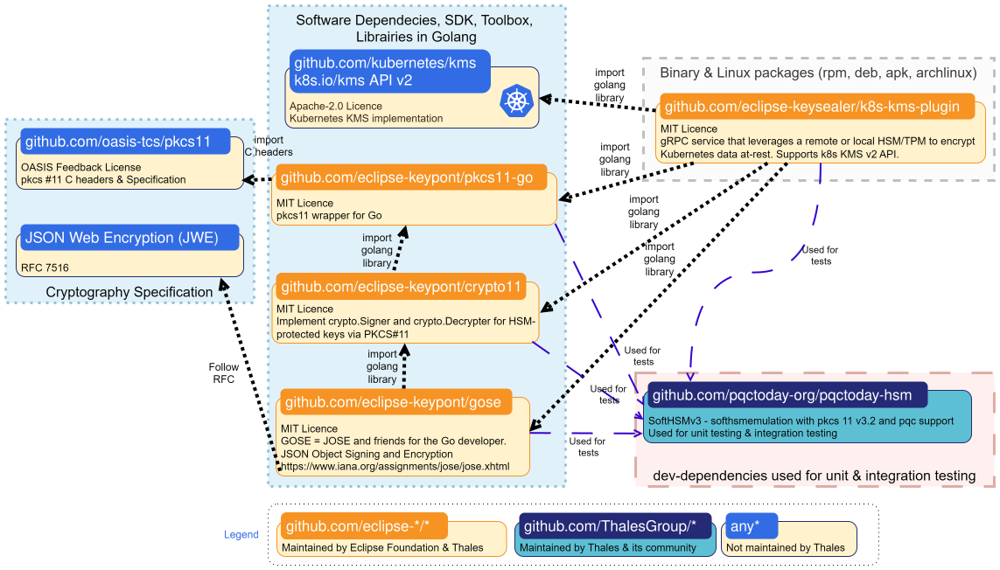

At runtime the plugin occupies exactly one step of the KMS v2 *envelope* scheme: it **never sees your `Secret`
data**, only the 32-byte DEK seed that `kube-apiserver` asks it to wrap with the KEK held on the TPM or HSM.

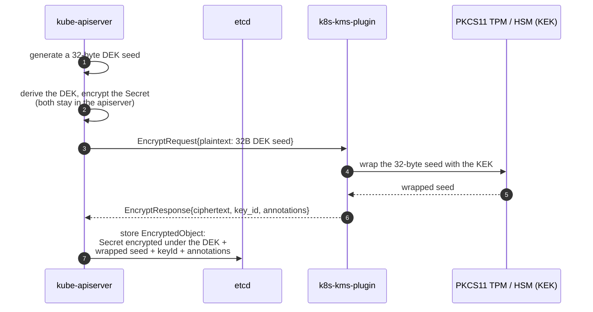

How that wrapping is actually done — JWE for `aes-gcm` / `aes-cbc` / `rsa-oaep`, a binary envelope plus a
`kem-ciphertext` annotation for `ml-kem` — is detailed in
[Cryptographic Schemes](./cryptographic-schemes.md). The `StatusRequest` heartbeat, the `DecryptRequest`
path and key rotation are drawn in full in the sequence diagrams of [Deployment Scenarios Examples](#deployment-scenarios-examples).

### Deployment Scenarios Examples

The following sequence diagram illustrates the communication between `kubernetes` ([KMS v2 API](https://pkg.go.dev/k8s.io/kms/apis/v2)), `k8s-kms-plugin`, and a [PKCS #11](https://docs.oasis-open.org/pkcs11/pkcs11-base/v3.0/pkcs11-base-v3.0.html) capable device like a TPM or HSM.

➡️ <b>click here</b> to show 🔦 k8s-kms-plugin & KMS v2 API Sequence Diagram 

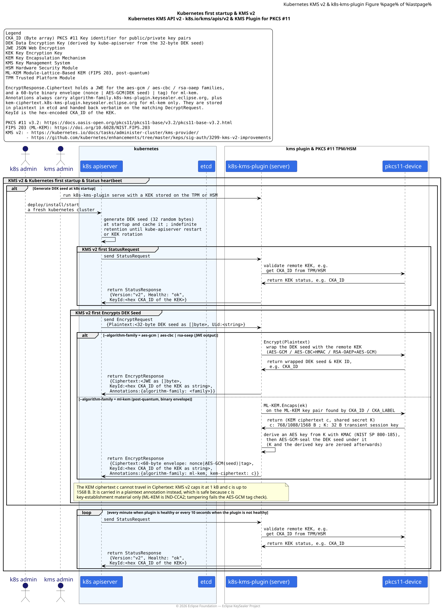

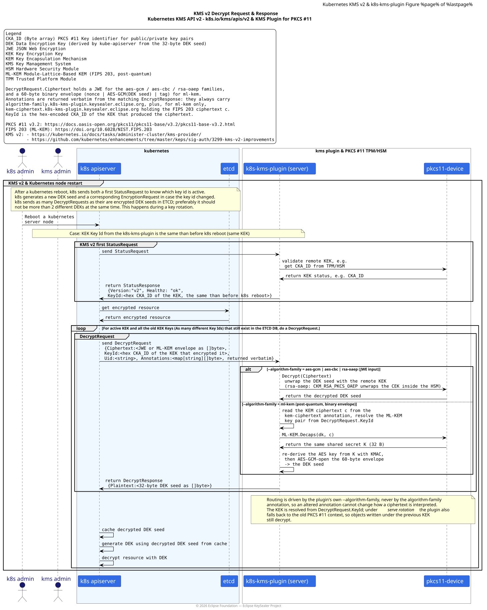

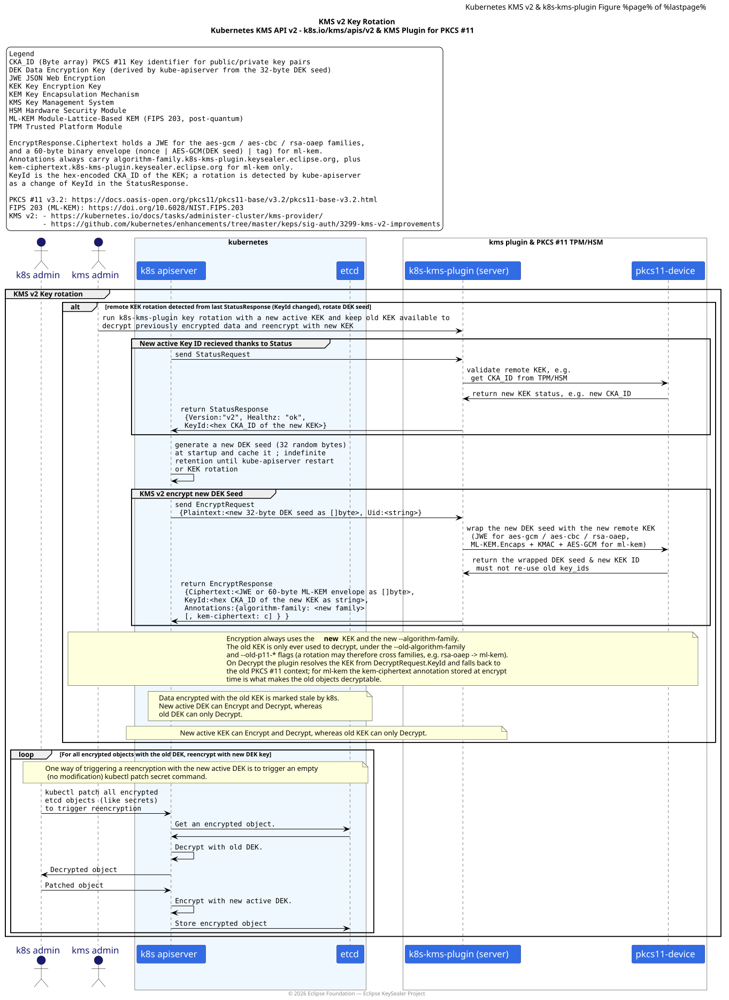
> This diagram was inspired by those from https://github.com/kubernetes/enhancements/tree/master/keps/sig-auth/3299-kms-v2-improvements

&NewLine;

The figure below illustrates several example of how the `k8s-kms-plugin` can be deployed for a Kubernetes Single Node cluster and using an embedded TPM or an HSM as a PKCS #11 capable key store.

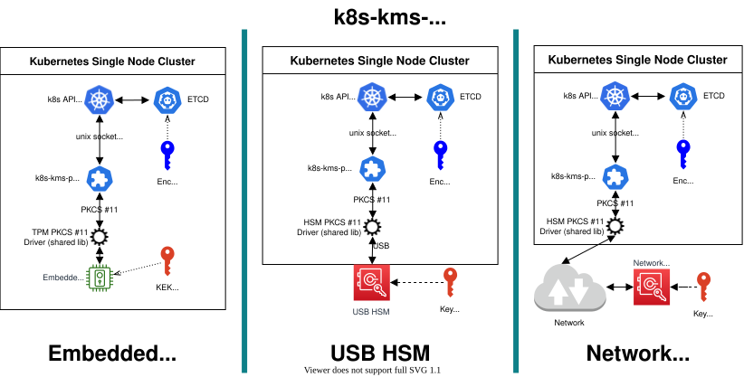

The `k8s-kms-plugin` also supports kubernetes cluster in HA mode (at least 3 server nodes), as long as the KEK is the same for each kubernetes node in the HA cluster. Otherwise it will fail to work with the Raft consensus algorithm for the synchronization of the content of the etcd cluster.

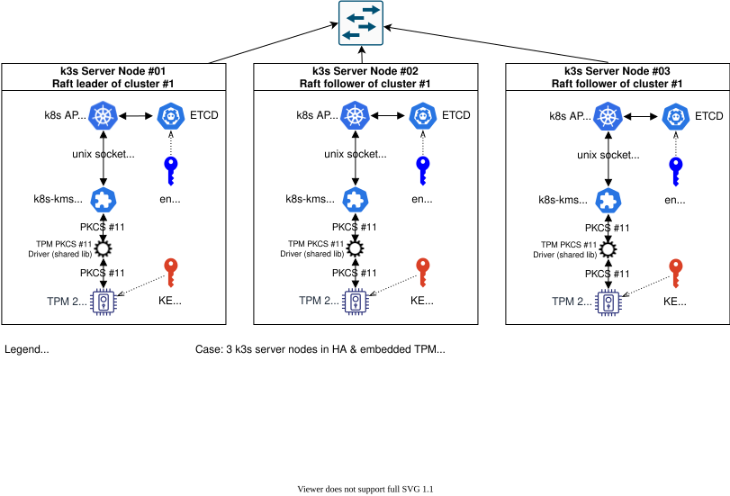

➡️ <b>click here</b> to show 🔦 other HA k8s-kms-plugin deployments

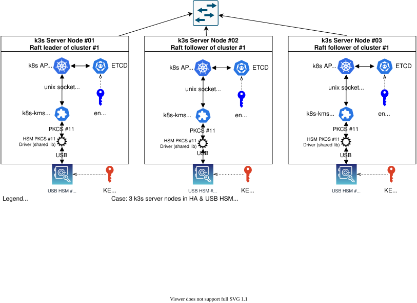
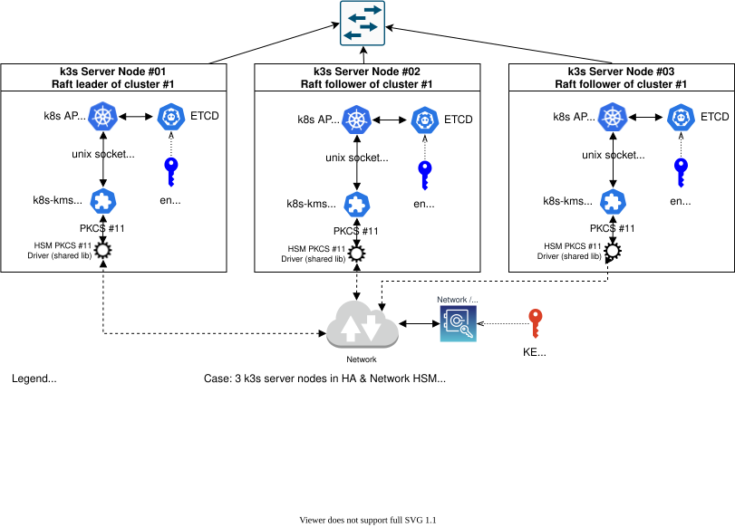

### Key Rotation Support

Look at [`k8s-kms-plugin serve rotation`](./cli-user-interface/markdown/k8s-kms-plugin_serve_rotation.md) for examples.

Figures below illustrate a Key Rotation sequence. First the KEK is stored on a TPM. Then rotation is being performed to use a USB HSM to store the new KEK.

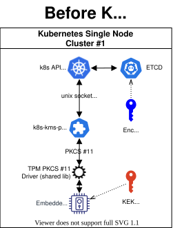

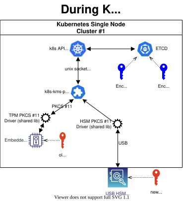

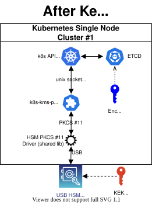
