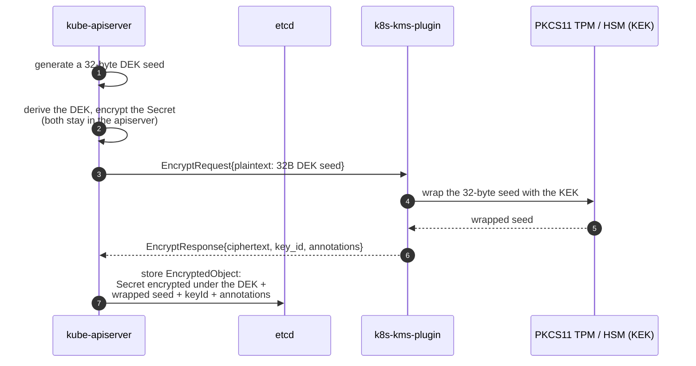

# Concepts & Architecture

## Definions & Accronyms 🔎

| Term         | Definition                               |
|--------------|------------------------------------------|
| **DEK**      | Data Encryption Key                      |
| **HA**       | High Availability                        |
| **HSM**      | Hardware Security Module                 |
| **JOSE**     | JOSE JSON Objects Signing and Encryption |
| **k3s**      | A Lightweight Kubernetes Distribution    |
| **k8s**      | Kubernetes (short for)                   |
| **KinD**     | Kubernetes in Docker (or Podman)         |
| **KEK**      | Key Encryption Key                       |
| **KMS**      | Key Management System                    |
| **PKCS #11** | Public Key Cryptography Standard #11     |
| **TPM**      | Trusted Platform Module                  |

## Overview 🔭

### Architecture

The [`k8s-kms-plugin`](https://github.com/eclipse-keysealer/k8s-kms-plugin) uses `gose`  and `crypto11`:

- [github.com/eclipse-keypont/gose](https://github.com/eclipse-keypont/gose): support in GoLang for JOSE JSON Objects Signing and Encryption;
- [github.com/eclipse-keypont/crypto11](https://github.com/eclipse-keypont/crypto11): Implements crypto.Signer abd crypto.Decrypter for PKCS#11 devices;
- [k8s.io/kms/apis/v2](https://pkg.go.dev/k8s.io/kms/apis/v2) (source code: https://github.com/kubernetes/kms): KMS v2 API & gRPC protobuf API files.

> 🚧 Note: We will work on providing a full nested SBOM later.

Figure below sums up the main dependencies of `k8s-kms-plugin`:

At runtime the plugin occupies exactly one step of the KMS v2 *envelope* scheme: it **never sees your `Secret`
data**, only the 32-byte DEK seed that `kube-apiserver` asks it to wrap with the KEK held on the TPM or HSM.

How that wrapping is actually done — JWE for `aes-gcm` / `aes-cbc` / `rsa-oaep`, a binary envelope plus a
`kem-ciphertext` annotation for `ml-kem` — is detailed in
[Cryptographic Schemes](./cryptographic-schemes.md). The `StatusRequest` heartbeat, the `DecryptRequest`
path and key rotation are drawn in full in the sequence diagrams of [Deployment Scenarios Examples](#deployment-scenarios-examples).

### Deployment Scenarios Examples

The following sequence diagram illustrates the communication between `kubernetes` ([KMS v2 API](https://pkg.go.dev/k8s.io/kms/apis/v2)), `k8s-kms-plugin`, and a [PKCS #11](https://docs.oasis-open.org/pkcs11/pkcs11-base/v3.0/pkcs11-base-v3.0.html) capable device like a TPM or HSM.

➡️ <b>click here</b> to show 🔦 k8s-kms-plugin & KMS v2 API Sequence Diagram 

> This diagram was inspired by those from https://github.com/kubernetes/enhancements/tree/master/keps/sig-auth/3299-kms-v2-improvements

&NewLine;

The figure below illustrates several example of how the `k8s-kms-plugin` can be deployed for a Kubernetes Single Node cluster and using an embedded TPM or an HSM as a PKCS #11 capable key store.

The `k8s-kms-plugin` also supports kubernetes cluster in HA mode (at least 3 server nodes), as long as the KEK is the same for each kubernetes node in the HA cluster. Otherwise it will fail to work with the Raft consensus algorithm for the synchronization of the content of the etcd cluster.

➡️ <b>click here</b> to show 🔦 other HA k8s-kms-plugin deployments

### Key Rotation Support

Look at [`k8s-kms-plugin serve rotation`](./cli-user-interface/markdown/k8s-kms-plugin_serve_rotation.md) for examples.

Figures below illustrate a Key Rotation sequence. First the KEK is stored on a TPM. Then rotation is being performed to use a USB HSM to store the new KEK.

